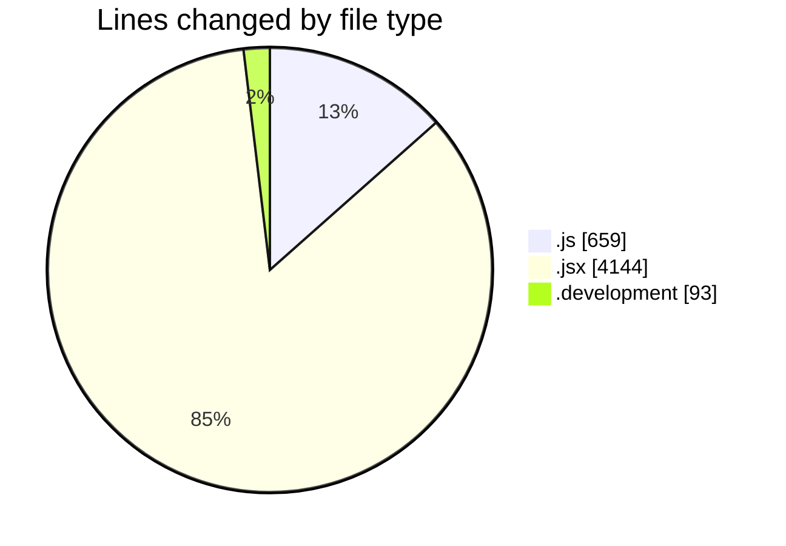
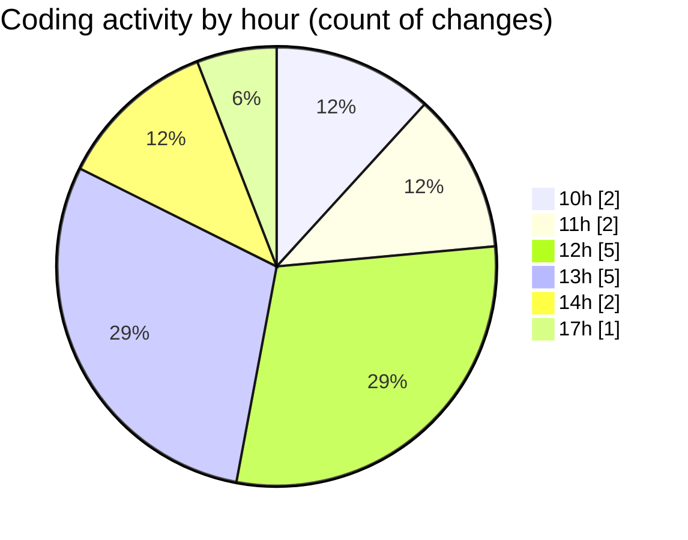

# nxtqube_webapp - Activity Summary 

## Overall Statistics

| Stat                   | Value                                                             |
| ---------------------- | ----------------------------------------------------------------- |
| **Lines Added** (➕)   | 4768                                          |
| **Lines Removed** (➖) | 128                                        |
| **Net Change** (↕)    | 4640                |
| **Active Time** (⌚)   | 15 minutes |

## Modified Files
- **mission.controller.js** (+551, -108)
- **createGridMission.jsx** (+2404, -19)
- **Map.jsx** (+1721, -0)
- **.env.development** (+89, -1)
- **.env.development** (+3, -0)

## Visualizations

### By File Type (Lines Changed)

### By Hour (Estimated Activity Count)

> **Last Updated:** 05/01/2026, 17:44:26