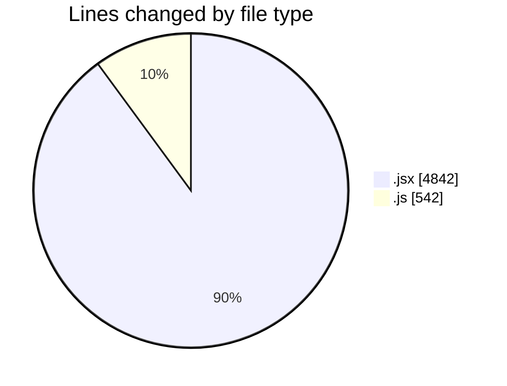
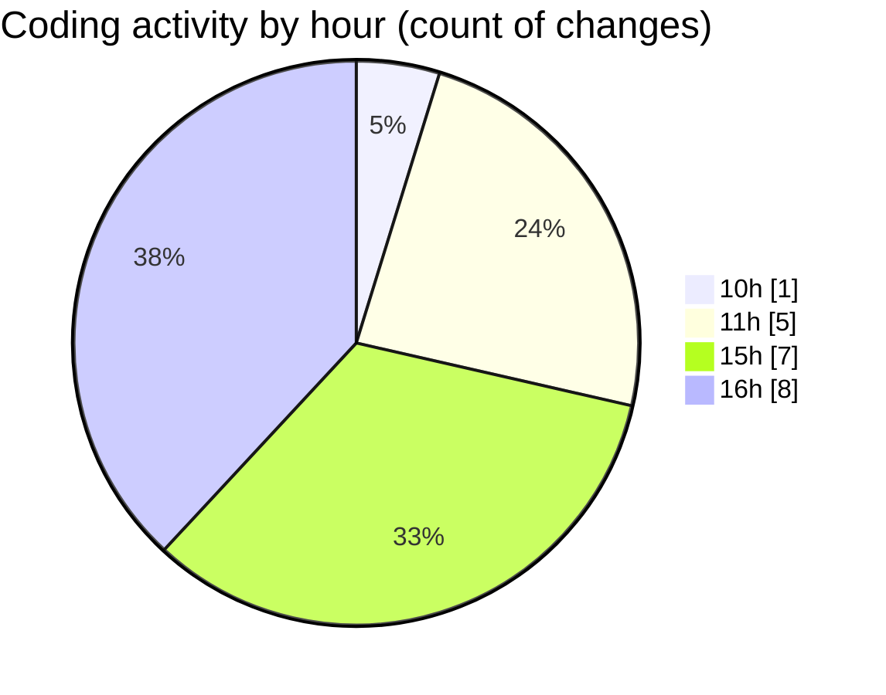

# nxtqube_webapp - Activity Summary 

## Overall Statistics

| Stat                   | Value                                                             |
| ---------------------- | ----------------------------------------------------------------- |
| **Lines Added** (➕)   | 5338                                          |
| **Lines Removed** (➖) | 46                                        |
| **Net Change** (↕)    | 5292                |
| **Active Time** (⌚)   | 35 minutes |

## Modified Files
- **Map.jsx** (+1783, -0)
- **validateGridSiteArea.js** (+29, -0)
- **createGridMission.jsx** (+2422, -0)
- **DockCard.jsx** (+275, -0)
- **HandleAddWaypointOnclick.js** (+475, -0)
- **alert.js** (+38, -0)
- **MapControls.jsx** (+316, -46)

## Visualizations

### By File Type (Lines Changed)

### By Hour (Estimated Activity Count)

> **Last Updated:** 07/01/2026, 16:27:34