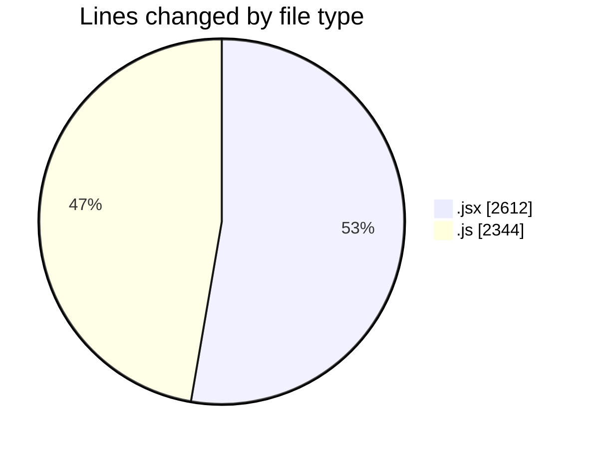
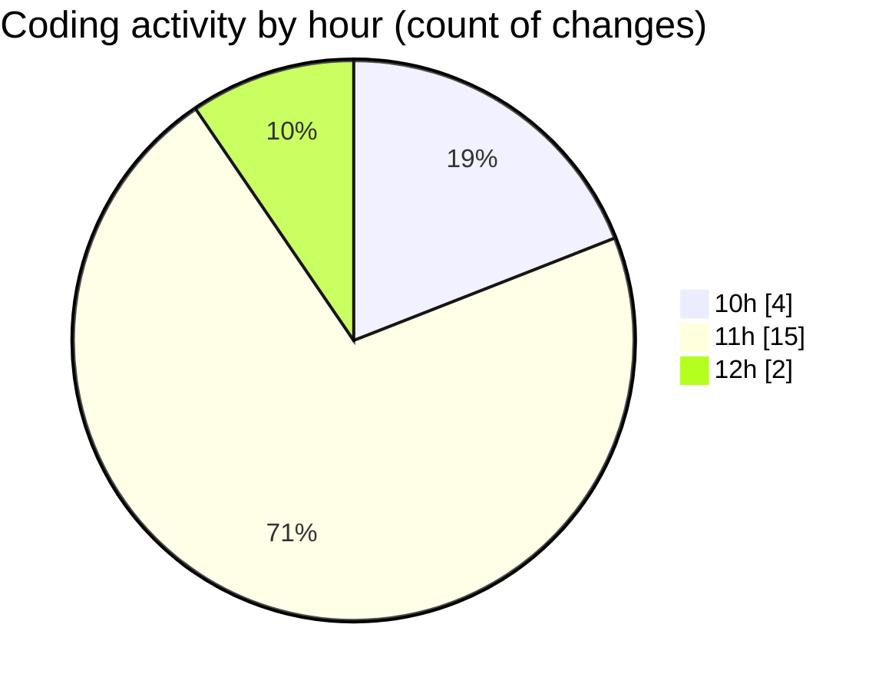

# nxtqube_webapp - Activity Summary 

## Overall Statistics

| Stat                   | Value                                                             |
| ---------------------- | ----------------------------------------------------------------- |
| **Lines Added** (➕)   | 4695                                          |
| **Lines Removed** (➖) | 261                                        |
| **Net Change** (↕)    | 4434                |
| **Active Time** (⌚)   | 22 minutes |

## Modified Files
- **Map.jsx** (+2053, -261)
- **vite.config.js** (+34, -0)
- **MapControls.jsx** (+298, -0)
- **useFenceManagement.js** (+2310, -0)

## Visualizations

### By File Type (Lines Changed)

### By Hour (Estimated Activity Count)

> **Last Updated:** 08/01/2026, 12:45:43