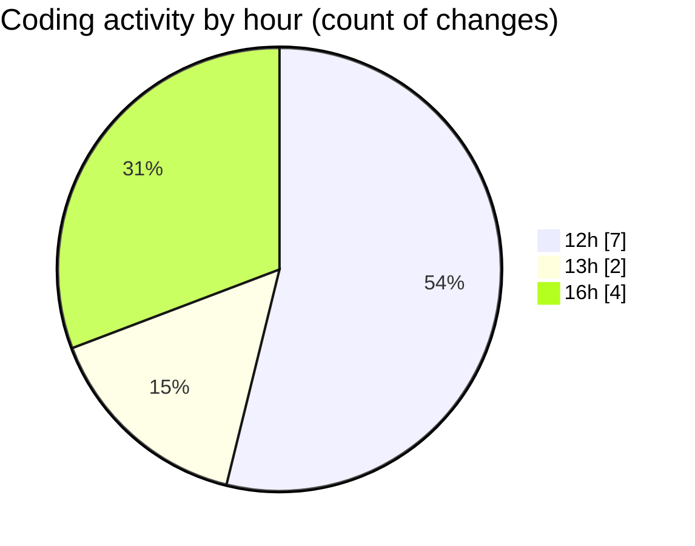

# nxtqube_webapp - Activity Summary 

## Overall Statistics

| Stat                   | Value                                                             |
| ---------------------- | ----------------------------------------------------------------- |
| **Lines Added** (➕)   | 632                                          |
| **Lines Removed** (➖) | 226                                        |
| **Net Change** (↕)    | 406                |
| **Active Time** (⌚)   | 16 minutes |

## Modified Files
- **vite.config.js** (+41, -4)
- **router.tsx** (+202, -0)
- **MissionsLayout.jsx** (+357, -222)
- **ExistingMissionsPage.jsx** (+32, -0)

## Visualizations

### By File Type (Lines Changed)

### By Hour (Estimated Activity Count)

> **Last Updated:** 09/01/2026, 16:46:10