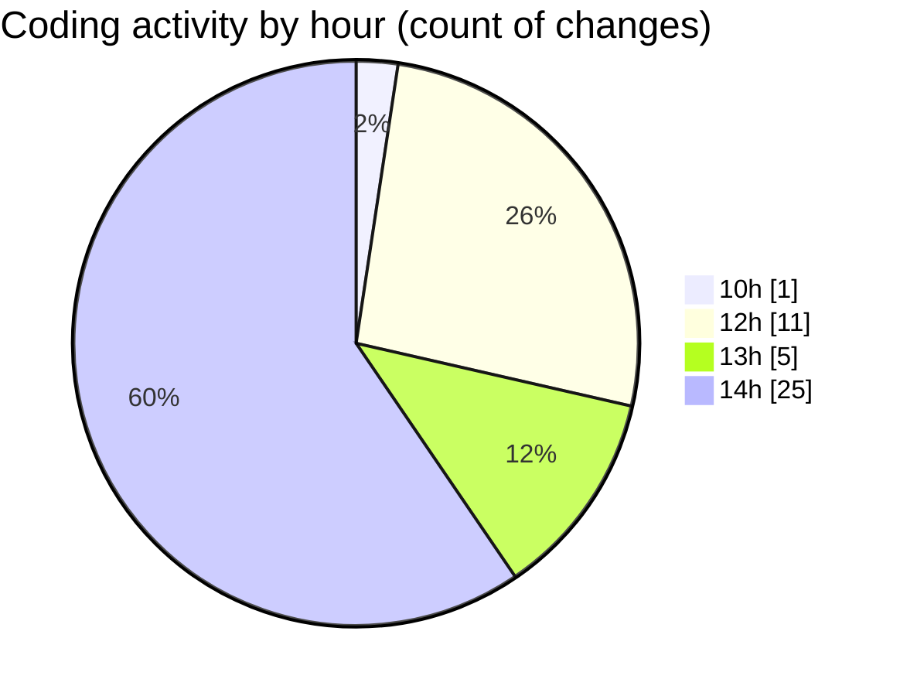

# nxtqube_webapp - Activity Summary 

## Overall Statistics

| Stat                   | Value                                                             |
| ---------------------- | ----------------------------------------------------------------- |
| **Lines Added** (➕)   | 4077                                          |
| **Lines Removed** (➖) | 45                                        |
| **Net Change** (↕)    | 4032                |
| **Active Time** (⌚)   | 55 minutes |

## Modified Files
- **MissionsNav.jsx** (+140, -0)
- **MissionPages.jsx** (+238, -0)
- **Map.jsx** (+1814, -22)
- **createPathMission.jsx** (+116, -9)
- **MissionsLayout.jsx** (+237, -13)
- **MapControls.jsx** (+480, -0)
- **store.js** (+117, -0)
- **Existing.jsx** (+256, -1)
- **ExistingMission.jsx** (+679, -0)

## Visualizations

### By File Type (Lines Changed)

### By Hour (Estimated Activity Count)

> **Last Updated:** 12/01/2026, 14:57:17