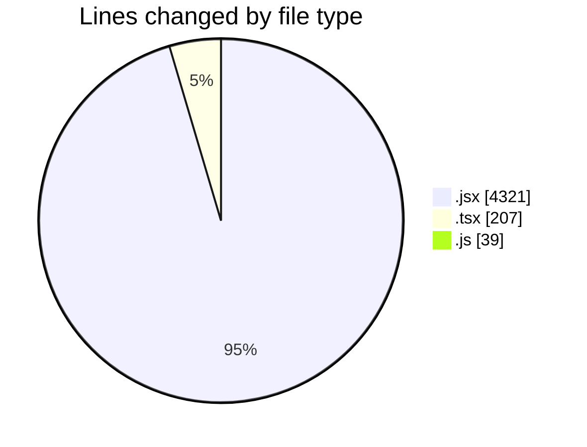
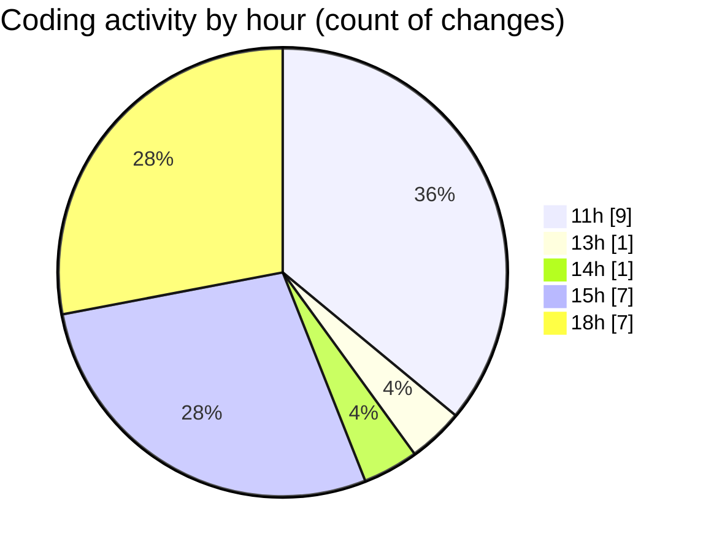

# nxtqube_webapp - Activity Summary 

## Overall Statistics

| Stat                   | Value                                                             |
| ---------------------- | ----------------------------------------------------------------- |
| **Lines Added** (➕)   | 4478                                          |
| **Lines Removed** (➖) | 89                                        |
| **Net Change** (↕)    | 4389                |
| **Active Time** (⌚)   | 38 minutes |

## Modified Files
- **ExistingMission.jsx** (+1375, -85)
- **DeleteMission.jsx** (+38, -0)
- **createGridMission.jsx** (+2425, -4)
- **site.create.jsx** (+394, -0)
- **router.tsx** (+207, -0)
- **vite.config.js** (+39, -0)

## Visualizations

### By File Type (Lines Changed)

### By Hour (Estimated Activity Count)

> **Last Updated:** 13/01/2026, 18:49:37