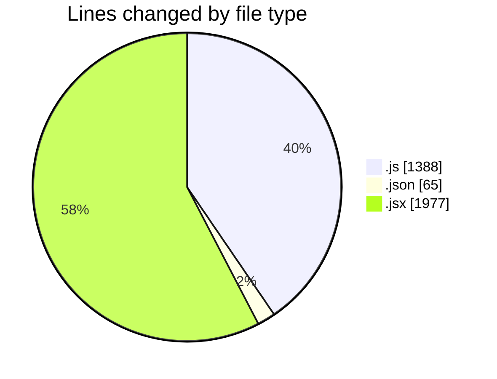
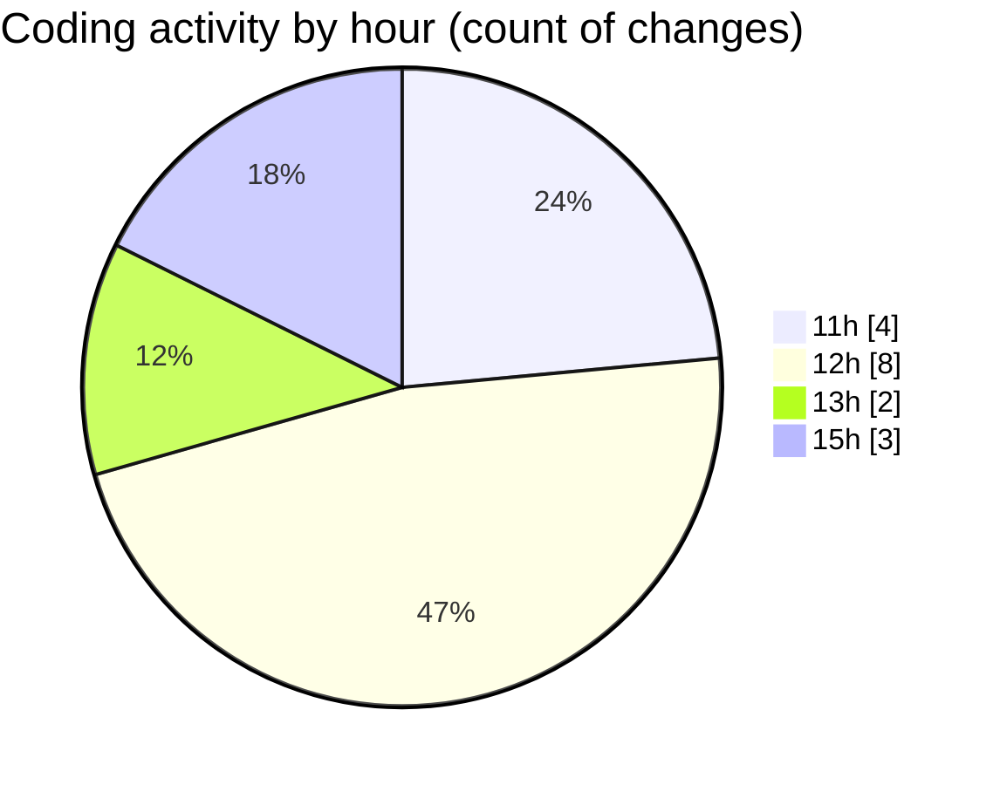

# nxtqube_webapp - Activity Summary 

## Overall Statistics

| Stat                   | Value                                                             |
| ---------------------- | ----------------------------------------------------------------- |
| **Lines Added** (➕)   | 3352                                          |
| **Lines Removed** (➖) | 78                                        |
| **Net Change** (↕)    | 3274                |
| **Active Time** (⌚)   | 13 minutes |

## Modified Files
- **vite.config.js** (+39, -0)
- **package.json** (+65, -0)
- **CreateFenceForm.jsx** (+1214, -0)
- **mission.controller.js** (+1169, -70)
- **SaveMissionModal.jsx** (+124, -0)
- **mission.api.js** (+106, -4)
- **createMissionHome.jsx** (+635, -4)

## Visualizations

### By File Type (Lines Changed)

### By Hour (Estimated Activity Count)

> **Last Updated:** 14/01/2026, 15:09:41