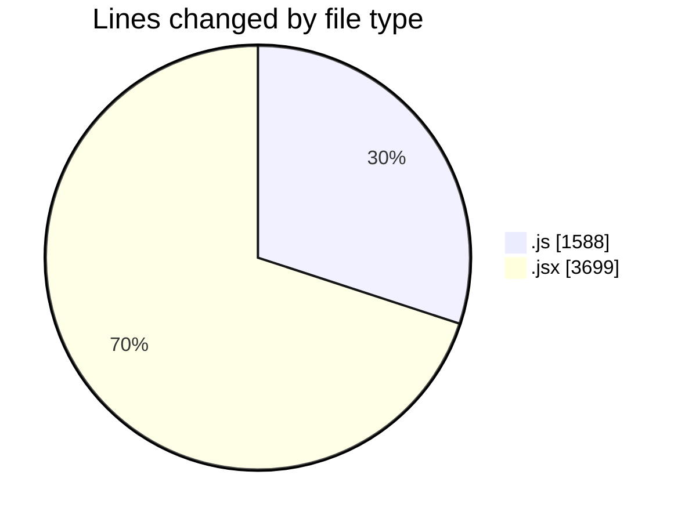
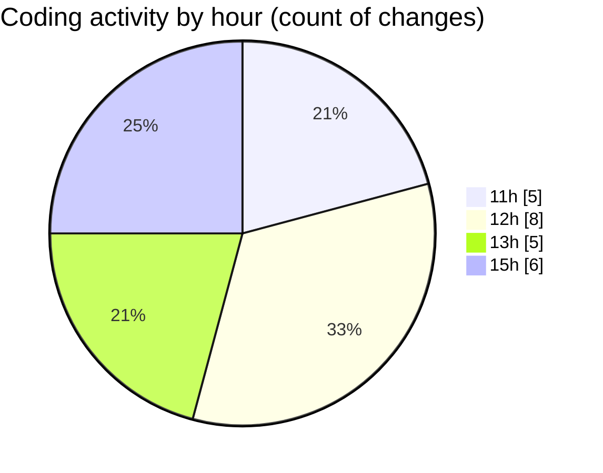

# nxtqube_webapp - Activity Summary 

## Overall Statistics

| Stat                   | Value                                                             |
| ---------------------- | ----------------------------------------------------------------- |
| **Lines Added** (➕)   | 5249                                          |
| **Lines Removed** (➖) | 38                                        |
| **Net Change** (↕)    | 5211                |
| **Active Time** (⌚)   | 28 minutes |

## Modified Files
- **mission.controller.js** (+1244, -18)
- **createMissionHome.jsx** (+1262, -1)
- **locationService.js** (+187, -18)
- **missionTimeDataSlice.js** (+23, -0)
- **mission.action.js** (+98, -0)
- **createGridMission.jsx** (+2435, -1)

## Visualizations

### By File Type (Lines Changed)

### By Hour (Estimated Activity Count)

> **Last Updated:** 15/01/2026, 15:36:48