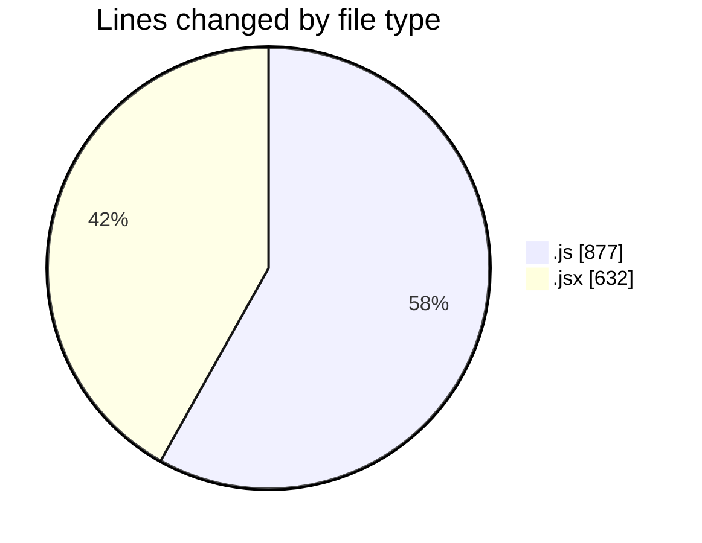
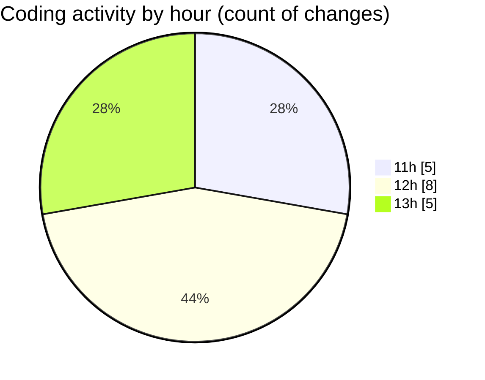

# nxtqube_webapp - Activity Summary 

## Overall Statistics

| Stat                   | Value                                                             |
| ---------------------- | ----------------------------------------------------------------- |
| **Lines Added** (➕)   | 1472                                          |
| **Lines Removed** (➖) | 37                                        |
| **Net Change** (↕)    | 1435                |
| **Active Time** (⌚)   | 24 minutes |

## Modified Files
- **mission.controller.js** (+631, -18)
- **createMissionHome.jsx** (+631, -1)
- **locationService.js** (+187, -18)
- **missionTimeDataSlice.js** (+23, -0)

## Visualizations

### By File Type (Lines Changed)

### By Hour (Estimated Activity Count)

> **Last Updated:** 15/01/2026, 13:15:36