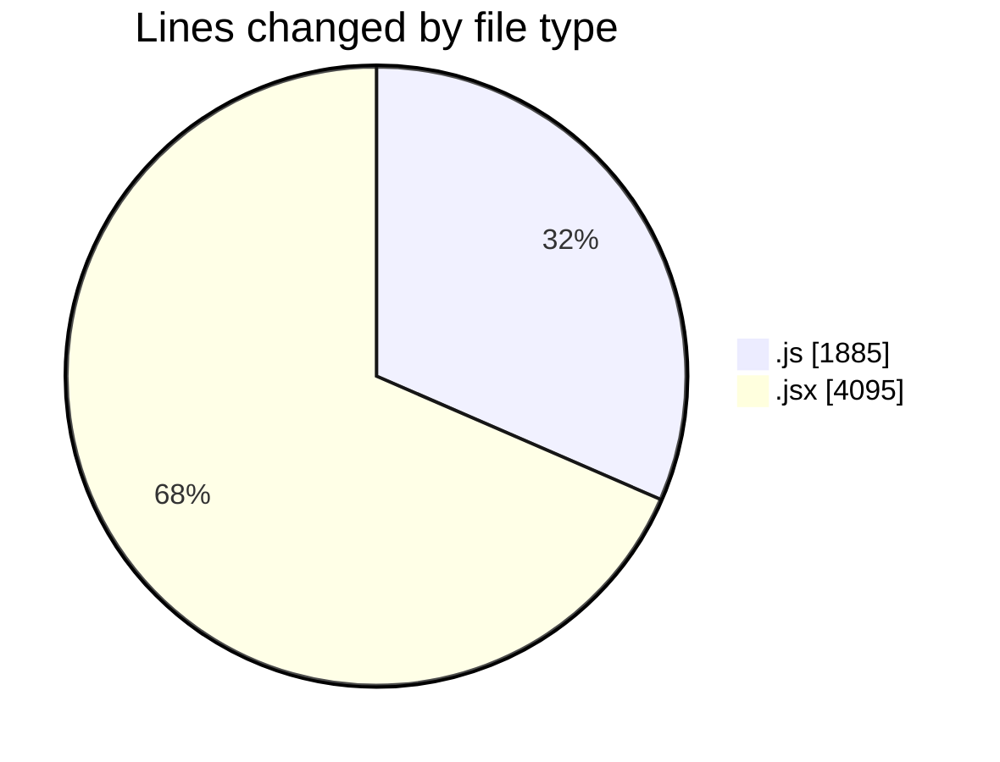
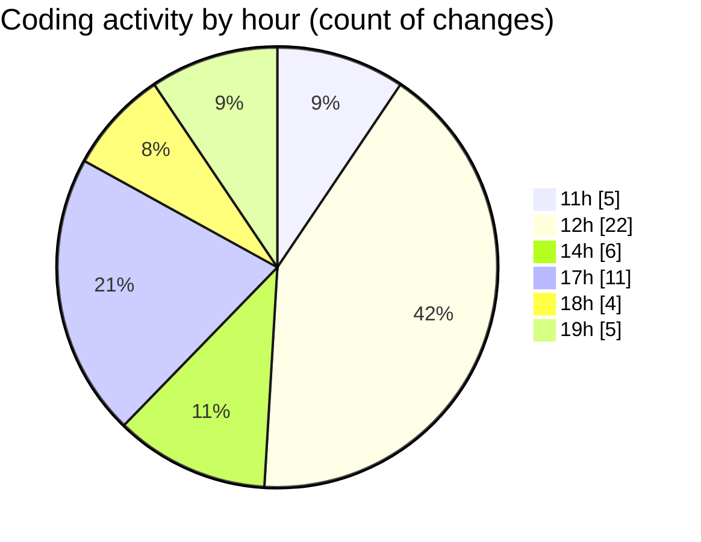

# nxtqube_webapp - Activity Summary 

## Overall Statistics

| Stat                   | Value                                                             |
| ---------------------- | ----------------------------------------------------------------- |
| **Lines Added** (➕)   | 5761                                          |
| **Lines Removed** (➖) | 219                                        |
| **Net Change** (↕)    | 5542                |
| **Active Time** (⌚)   | 79 minutes |

## Modified Files
- **fenceData.route.js** (+92, -55)
- **geofence.api.js** (+93, -0)
- **MissionPages.jsx** (+301, -22)
- **createPathMission.jsx** (+228, -28)
- **ConfirmModal.jsx** (+45, -1)
- **DeleteMission.jsx** (+52, -3)
- **ExistingMission.jsx** (+723, -0)
- **createGridMission.jsx** (+2462, -110)
- **gridMissionUtils.js** (+1146, -0)
- **missionUtils.js** (+499, -0)
- **SaveMissionModal.jsx** (+120, -0)

## Visualizations

### By File Type (Lines Changed)

### By Hour (Estimated Activity Count)

> **Last Updated:** 19/01/2026, 19:19:13