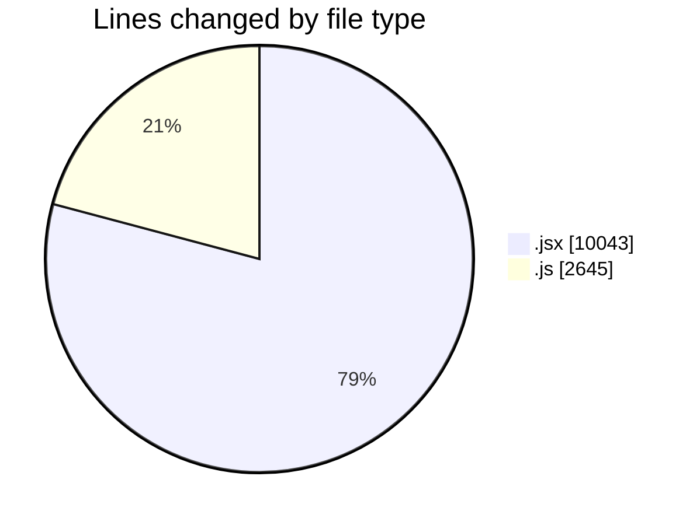
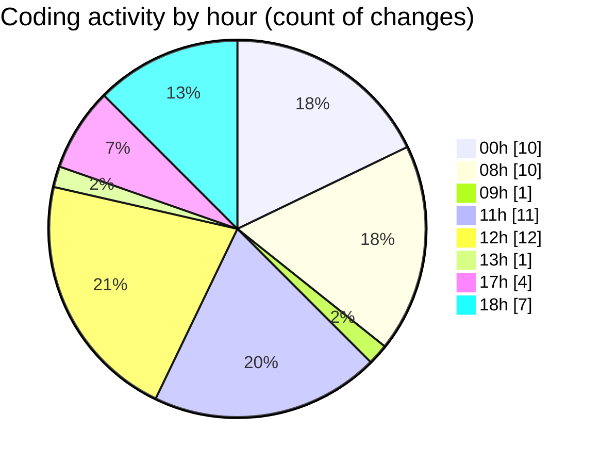

# nxtqube_webapp - Activity Summary 

## Overall Statistics

| Stat                   | Value                                                             |
| ---------------------- | ----------------------------------------------------------------- |
| **Lines Added** (➕)   | 12522                                          |
| **Lines Removed** (➖) | 166                                        |
| **Net Change** (↕)    | 12356                |
| **Active Time** (⌚)   | 73 minutes |

## Modified Files
- **Map.jsx** (+5333, -0)
- **missionUtils.js** (+958, -0)
- **createMissionHome.jsx** (+1333, -28)
- **createPathMission.jsx** (+115, -0)
- **createGridMission.jsx** (+2441, -0)
- **DeleteMission.jsx** (+51, -0)
- **ExistingMission.jsx** (+739, -3)
- **useMissionDisplay.js** (+1552, -135)

## Visualizations

### By File Type (Lines Changed)

### By Hour (Estimated Activity Count)

> **Last Updated:** 20/01/2026, 18:12:12