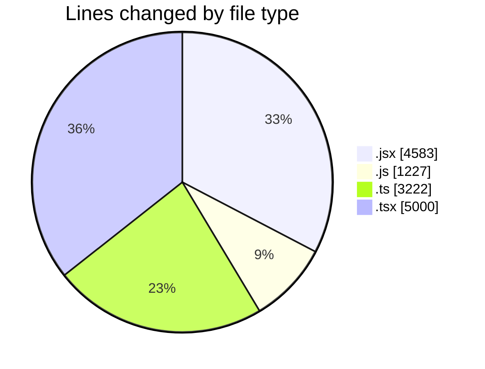
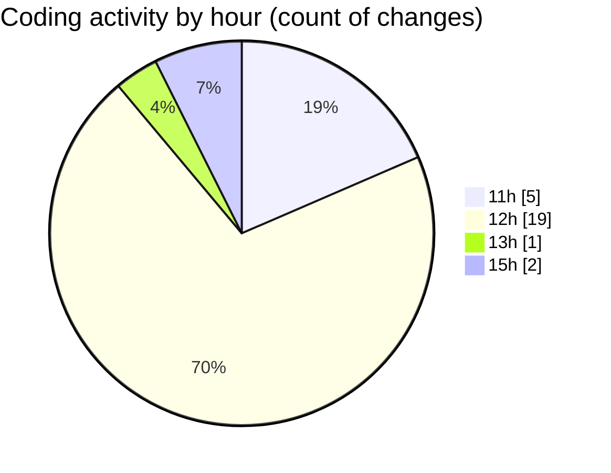

# nxtqube_webapp - Activity Summary 

## Overall Statistics

| Stat                   | Value                                                             |
| ---------------------- | ----------------------------------------------------------------- |
| **Lines Added** (➕)   | 13707                                          |
| **Lines Removed** (➖) | 325                                        |
| **Net Change** (↕)    | 13382                |
| **Active Time** (⌚)   | 29 minutes |

## Modified Files
- **createGridMission.jsx** (+2449, -0)
- **create3DMission.jsx** (+1574, -0)
- **MissionInfo.jsx** (+560, -0)
- **useMissionDisplay.js** (+1227, -0)
- **gridMissionUtils.ts** (+2914, -308)
- **createGridMission.tsx** (+2462, -13)
- **Map.tsx** (+1783, -2)
- **ExistingMission.tsx** (+738, -2)

## Visualizations

### By File Type (Lines Changed)

### By Hour (Estimated Activity Count)

> **Last Updated:** 21/01/2026, 15:29:48