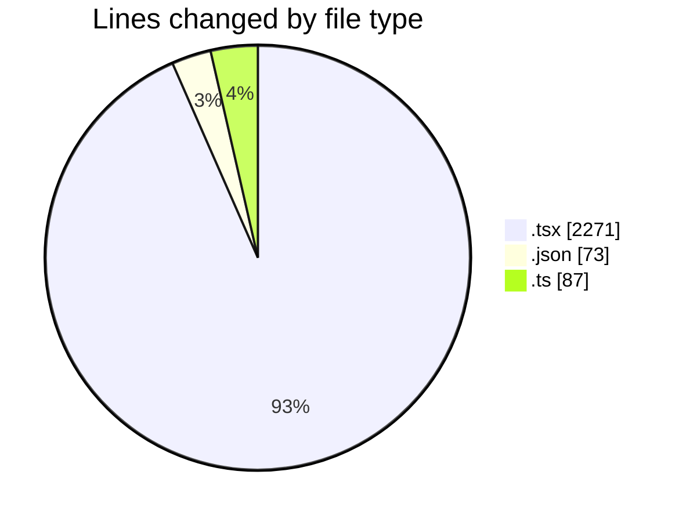
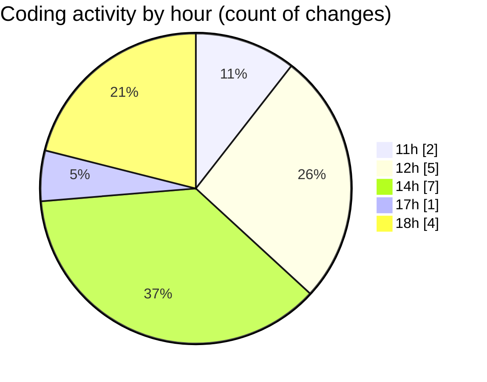

# nxtqube_webapp - Activity Summary 

## Overall Statistics

| Stat                   | Value                                                             |
| ---------------------- | ----------------------------------------------------------------- |
| **Lines Added** (➕)   | 2413                                          |
| **Lines Removed** (➖) | 18                                        |
| **Net Change** (↕)    | 2395                |
| **Active Time** (⌚)   | 21 minutes |

## Modified Files
- **VideoStreamExample.tsx** (+122, -14)
- **VideoStreamContainer.tsx** (+100, -0)
- **Map.tsx** (+1799, -4)
- **package.json** (+73, -0)
- **useVideoStreamControls.ts** (+87, -0)
- **VideoStreamOverlay.tsx** (+56, -0)
- **VideoControlPanel.tsx** (+176, -0)

## Visualizations

### By File Type (Lines Changed)

### By Hour (Estimated Activity Count)

> **Last Updated:** 22/01/2026, 18:22:32