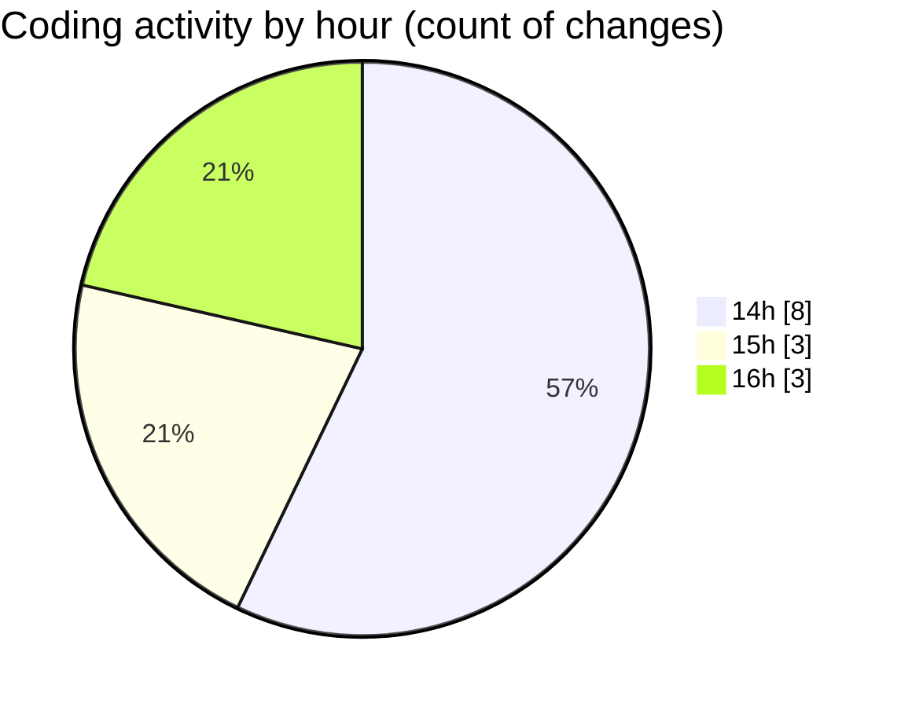

# nxtqube_webapp - Activity Summary 

## Overall Statistics

| Stat                   | Value                                                             |
| ---------------------- | ----------------------------------------------------------------- |
| **Lines Added** (➕)   | 484                                          |
| **Lines Removed** (➖) | 1                                        |
| **Net Change** (↕)    | 483                |
| **Active Time** (⌚)   | 11 minutes |

## Modified Files
- **site.actions.ts** (+75, -1)
- **site.reducer.ts** (+30, -0)
- **site.api.ts** (+86, -0)
- **dock.reducer.ts** (+47, -0)
- **dock.actions.ts** (+110, -0)
- **drone.reducer.ts** (+40, -0)
- **drone.actions.ts** (+96, -0)

## Visualizations

### By File Type (Lines Changed)

### By Hour (Estimated Activity Count)

> **Last Updated:** 27/01/2026, 16:08:30