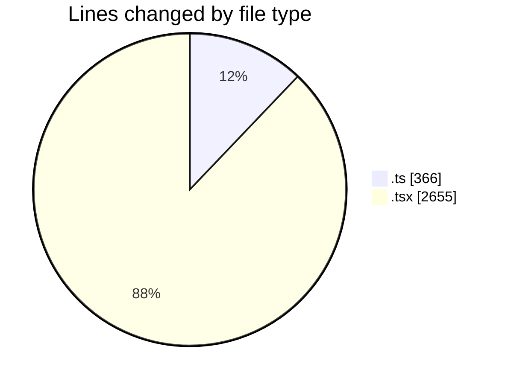
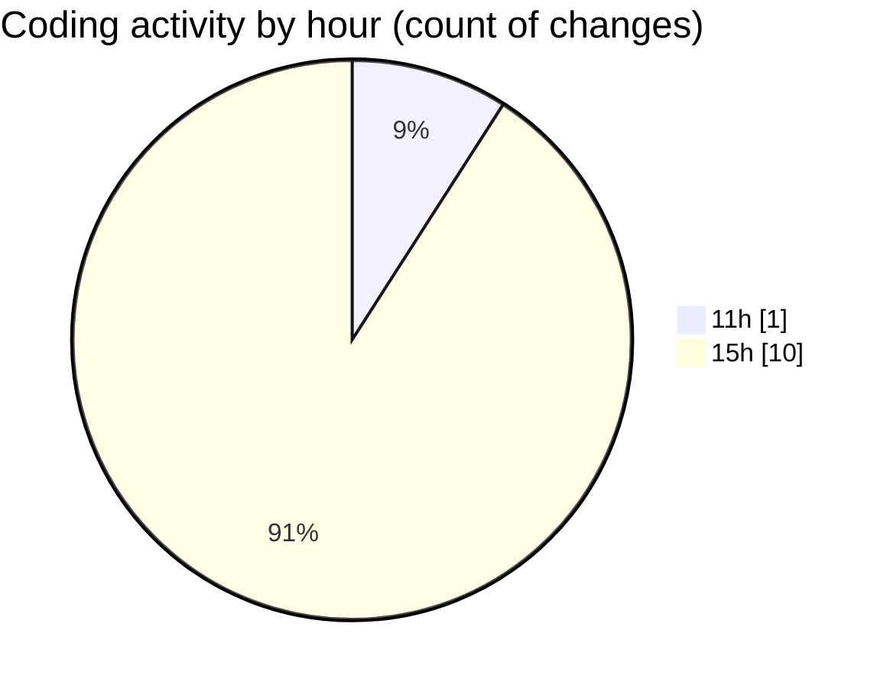

# nxtqube_webapp - Activity Summary 

## Overall Statistics

| Stat                   | Value                                                             |
| ---------------------- | ----------------------------------------------------------------- |
| **Lines Added** (➕)   | 3021                                          |
| **Lines Removed** (➖) | 0                                        |
| **Net Change** (↕)    | 3021                |
| **Active Time** (⌚)   | 10 minutes |

## Modified Files
- **fenceData.controller.ts** (+275, -0)
- **site.dock.drone.model.ts** (+91, -0)
- **DockCard.tsx** (+275, -0)
- **DockInfo.tsx** (+153, -0)
- **DroneInfo.tsx** (+165, -0)
- **createFlow.tsx** (+304, -0)
- **PointMissionSidebar.tsx** (+242, -0)
- **MissionFormDrawer.tsx** (+584, -0)
- **DroneControl.tsx** (+561, -0)
- **config.tsx** (+257, -0)
- **controls.tsx** (+114, -0)

## Visualizations

### By File Type (Lines Changed)

### By Hour (Estimated Activity Count)

> **Last Updated:** 28/01/2026, 15:07:05