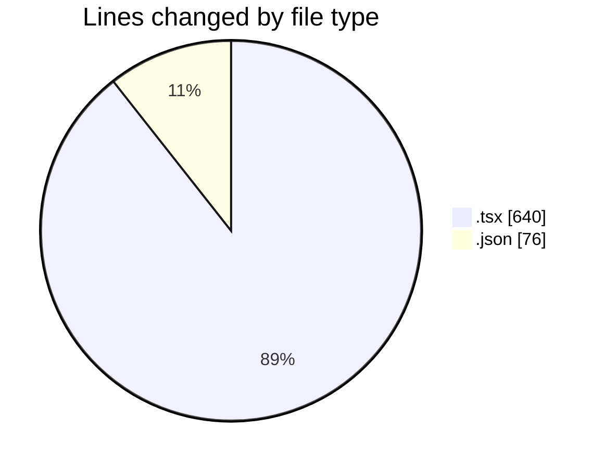
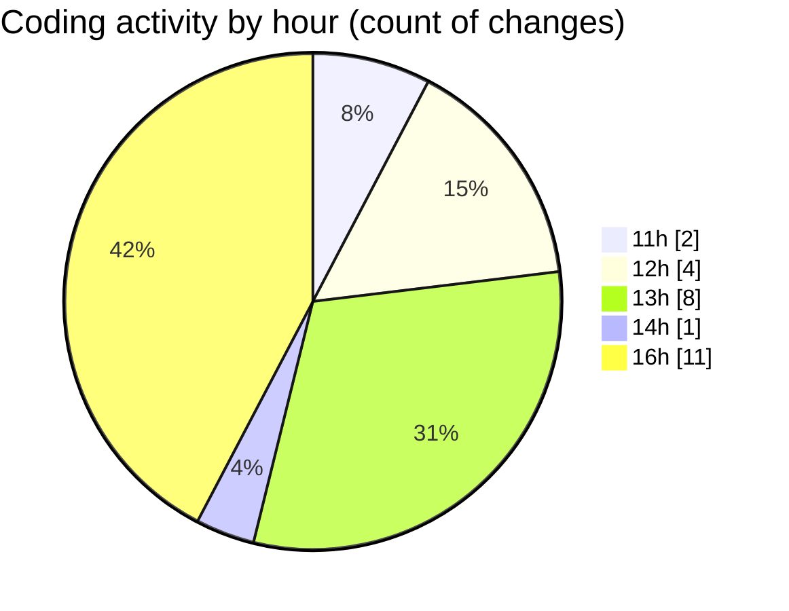

# nxtqube_webapp - Activity Summary 

## Overall Statistics

| Stat                   | Value                                                             |
| ---------------------- | ----------------------------------------------------------------- |
| **Lines Added** (➕)   | 648                                          |
| **Lines Removed** (➖) | 68                                        |
| **Net Change** (↕)    | 580                |
| **Active Time** (⌚)   | 22 minutes |

## Modified Files
- **cesium.container.tsx** (+45, -2)
- **GeofenceAlt.tsx** (+59, -0)
- **geogence.create.tsx** (+468, -66)
- **settings.json** (+76, -0)

## Visualizations

### By File Type (Lines Changed)

### By Hour (Estimated Activity Count)

> **Last Updated:** 30/01/2026, 16:29:07