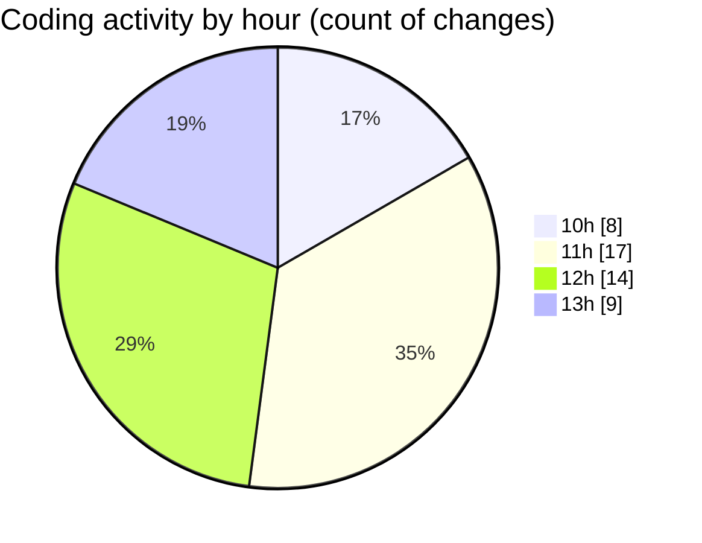

# nxtqube_webapp - Activity Summary 

## Overall Statistics

| Stat                   | Value                                                             |
| ---------------------- | ----------------------------------------------------------------- |
| **Lines Added** (➕)   | 1385                                          |
| **Lines Removed** (➖) | 48                                        |
| **Net Change** (↕)    | 1337                |
| **Active Time** (⌚)   | 71 minutes |

## Modified Files
- **geogence.create.tsx** (+896, -47)
- **GeofenceAlt.tsx** (+62, -1)
- **use.cesium.map.tsx** (+384, -0)
- **cesium.container.tsx** (+43, -0)

## Visualizations

### By File Type (Lines Changed)

### By Hour (Estimated Activity Count)

> **Last Updated:** 02/02/2026, 13:19:59