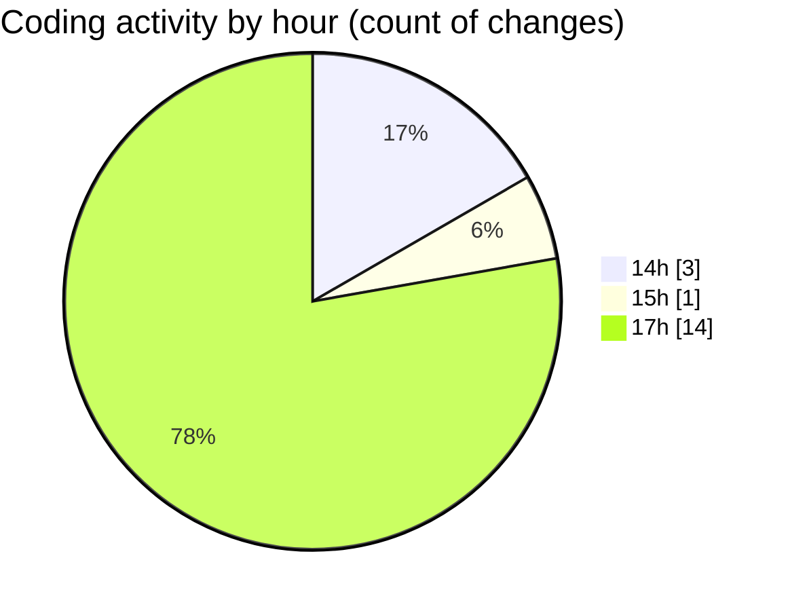

# nxtqube_webapp - Activity Summary 

## Overall Statistics

| Stat                   | Value                                                             |
| ---------------------- | ----------------------------------------------------------------- |
| **Lines Added** (➕)   | 1602                                          |
| **Lines Removed** (➖) | 5                                        |
| **Net Change** (↕)    | 1597                |
| **Active Time** (⌚)   | 20 minutes |

## Modified Files
- **geogence.create.tsx** (+1381, -3)
- **geofence.api.ts** (+93, -0)
- **geofence.validator.ts** (+128, -2)

## Visualizations

### By File Type (Lines Changed)

### By Hour (Estimated Activity Count)

> **Last Updated:** 04/02/2026, 17:46:49