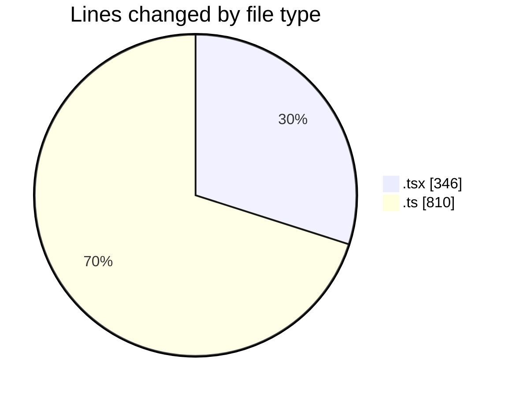
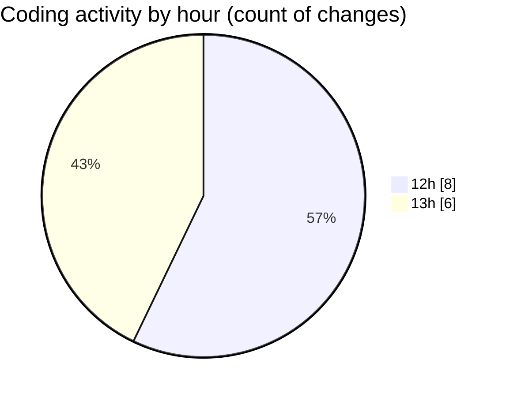

# nxtqube_webapp - Activity Summary 

## Overall Statistics

| Stat                   | Value                                                             |
| ---------------------- | ----------------------------------------------------------------- |
| **Lines Added** (➕)   | 1062                                          |
| **Lines Removed** (➖) | 94                                        |
| **Net Change** (↕)    | 968                |
| **Active Time** (⌚)   | 13 minutes |

## Modified Files
- **geogence.list.tsx** (+160, -0)
- **geofence.card.tsx** (+178, -8)
- **geofence.controller.ts** (+426, -86)
- **geofence.routes.ts** (+56, -0)
- **geofence.validator.ts** (+134, -0)
- **geofence.api.ts** (+108, -0)

## Visualizations

### By File Type (Lines Changed)

### By Hour (Estimated Activity Count)

> **Last Updated:** 05/02/2026, 13:36:39