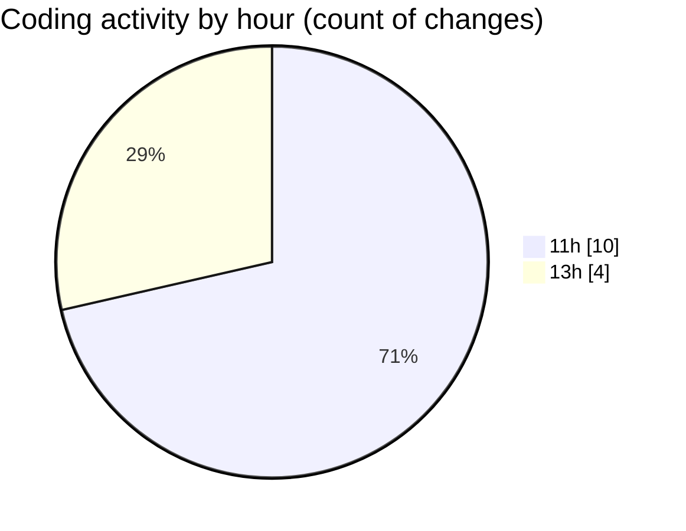

# nxtqube_webapp - Activity Summary 

## Overall Statistics

| Stat                   | Value                                                             |
| ---------------------- | ----------------------------------------------------------------- |
| **Lines Added** (➕)   | 2336                                          |
| **Lines Removed** (➖) | 24                                        |
| **Net Change** (↕)    | 2312                |
| **Active Time** (⌚)   | 21 minutes |

## Modified Files
- **geogence.list.tsx** (+244, -9)
- **geofence.card.tsx** (+205, -0)
- **geogence.create.tsx** (+1887, -15)

## Visualizations

### By File Type (Lines Changed)

### By Hour (Estimated Activity Count)

> **Last Updated:** 09/02/2026, 13:51:06