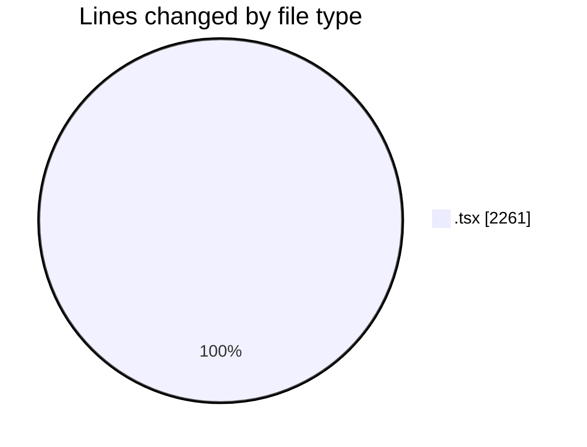
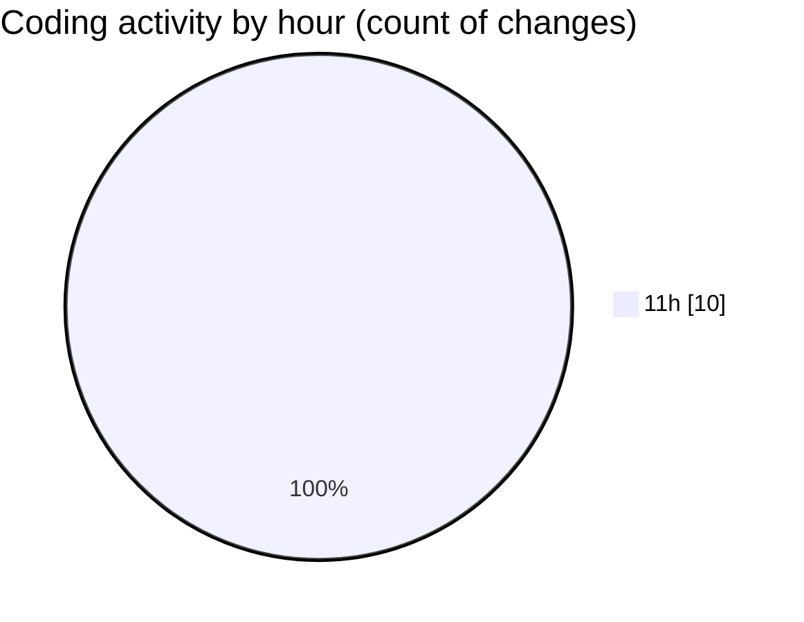

# nxtqube_webapp - Activity Summary 

## Overall Statistics

| Stat                   | Value                                                             |
| ---------------------- | ----------------------------------------------------------------- |
| **Lines Added** (➕)   | 2252                                          |
| **Lines Removed** (➖) | 9                                        |
| **Net Change** (↕)    | 2243                |
| **Active Time** (⌚)   | 14 minutes |

## Modified Files
- **geogence.list.tsx** (+244, -9)
- **geofence.card.tsx** (+205, -0)
- **geogence.create.tsx** (+1803, -0)

## Visualizations

### By File Type (Lines Changed)

### By Hour (Estimated Activity Count)

> **Last Updated:** 09/02/2026, 11:59:58