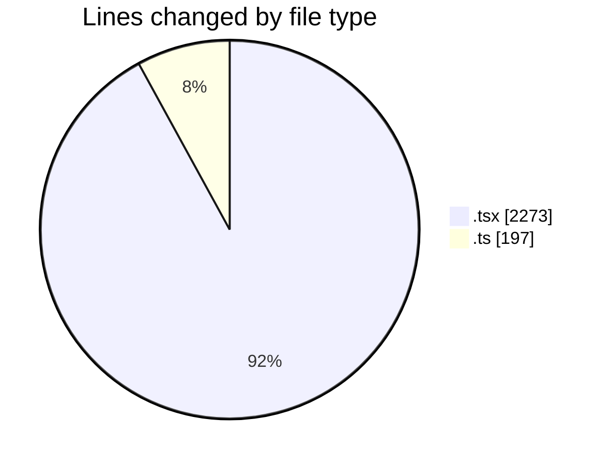
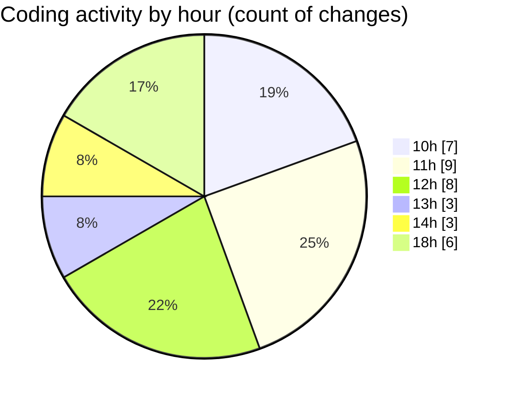

# nxtqube_webapp - Activity Summary 

## Overall Statistics

| Stat                   | Value                                                             |
| ---------------------- | ----------------------------------------------------------------- |
| **Lines Added** (➕)   | 1557                                          |
| **Lines Removed** (➖) | 913                                        |
| **Net Change** (↕)    | 644                |
| **Active Time** (⌚)   | 39 minutes |

## Modified Files
- **geogence.create.tsx** (+627, -777)
- **geofence.map.utils.tsx** (+685, -130)
- **geofence.card.tsx** (+38, -1)
- **geogence.list.tsx** (+10, -5)
- **geofence.reducer.ts** (+30, -0)
- **geofence.action.ts** (+167, -0)

## Visualizations

### By File Type (Lines Changed)

### By Hour (Estimated Activity Count)

> **Last Updated:** 10/02/2026, 19:09:01