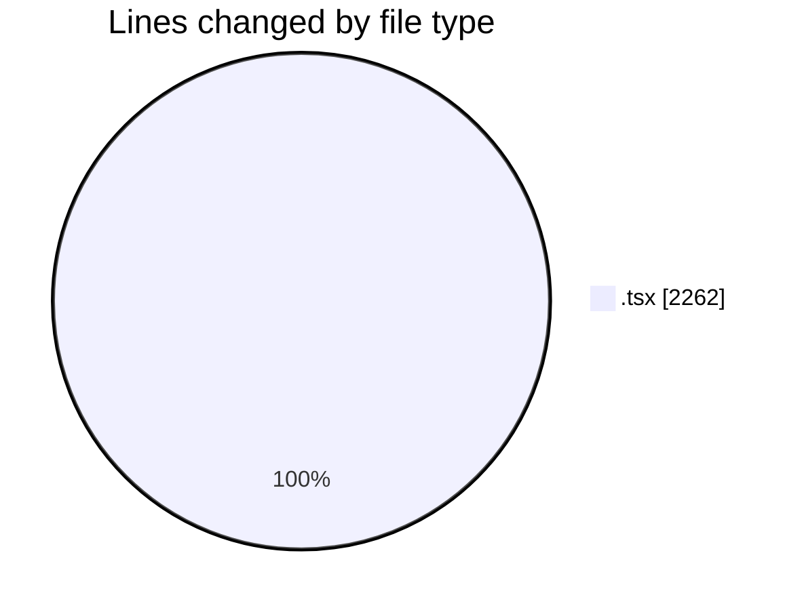
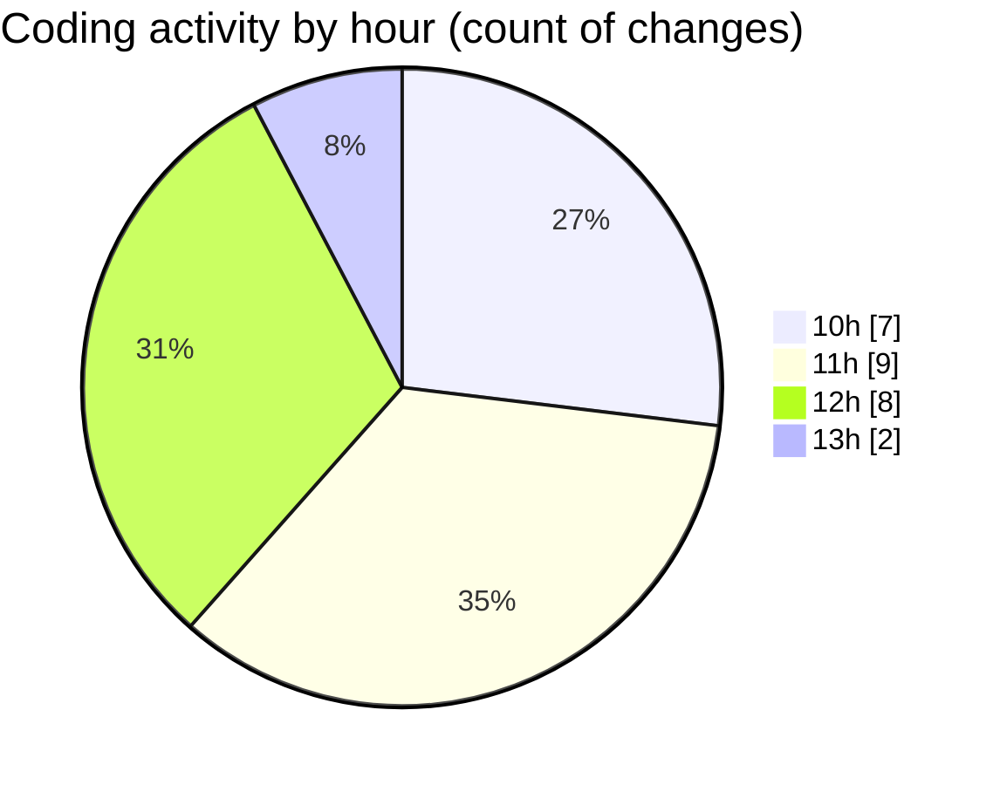

# nxtqube_webapp - Activity Summary 

## Overall Statistics

| Stat                   | Value                                                             |
| ---------------------- | ----------------------------------------------------------------- |
| **Lines Added** (➕)   | 1357                                          |
| **Lines Removed** (➖) | 905                                        |
| **Net Change** (↕)    | 452                |
| **Active Time** (⌚)   | 30 minutes |

## Modified Files
- **geogence.create.tsx** (+627, -775)
- **geofence.map.utils.tsx** (+685, -130)
- **geofence.card.tsx** (+38, -0)
- **geogence.list.tsx** (+7, -0)

## Visualizations

### By File Type (Lines Changed)

### By Hour (Estimated Activity Count)

> **Last Updated:** 10/02/2026, 13:34:44