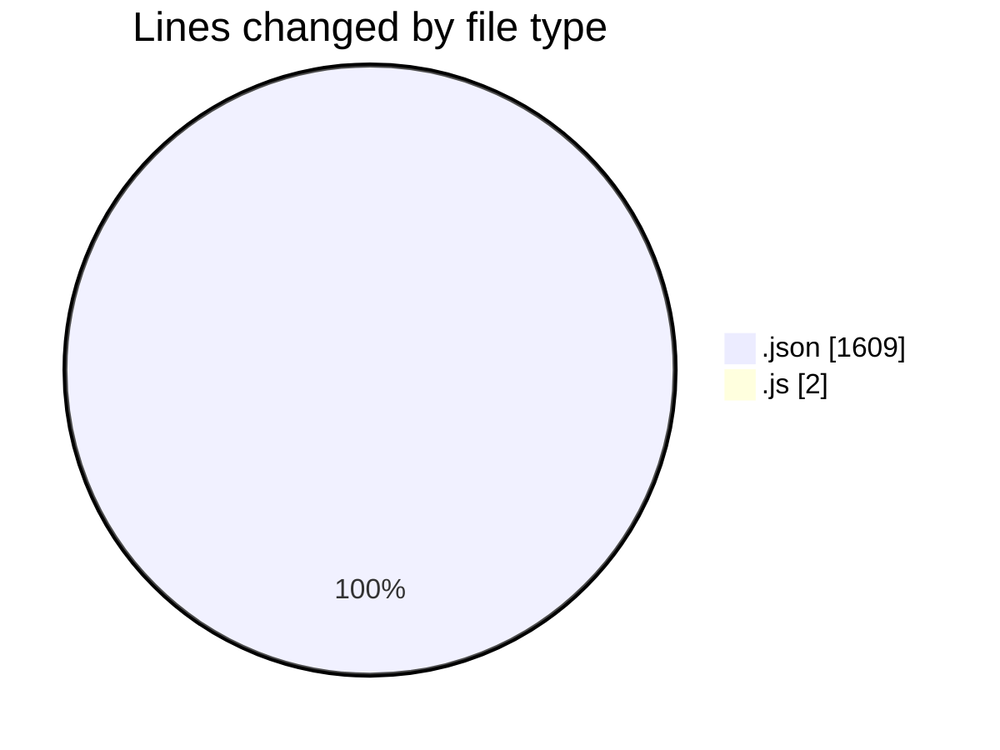
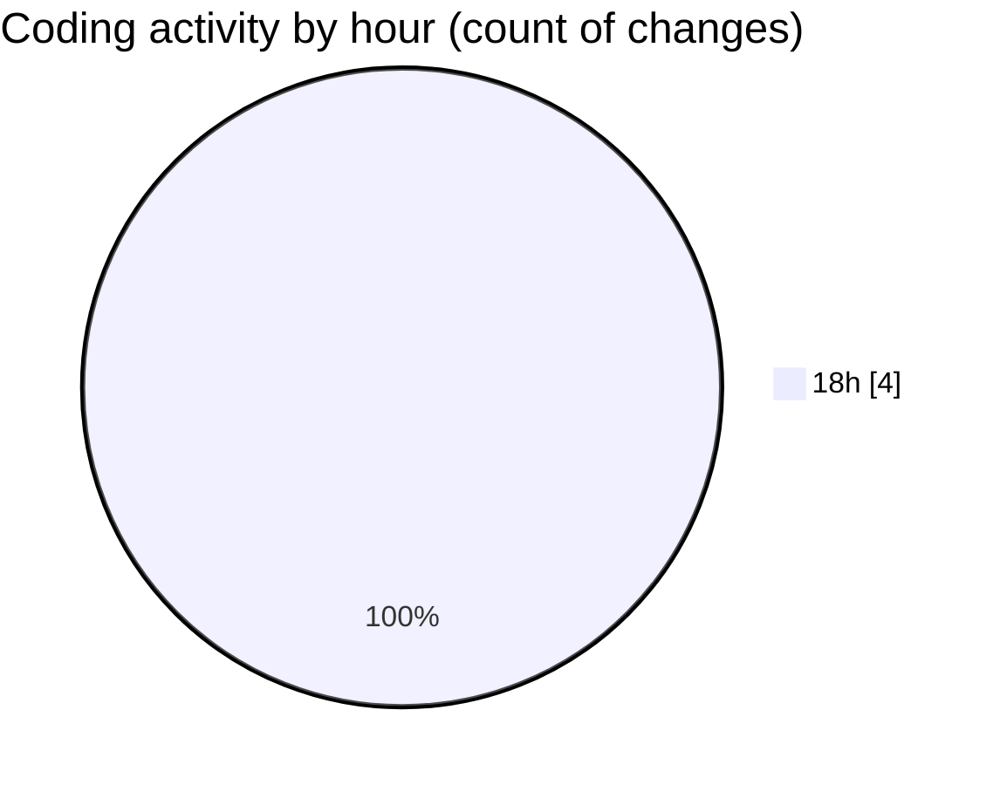

# GraphQL - Activity Summary 

## Overall Statistics

| Stat                   | Value                                                             |
| ---------------------- | ----------------------------------------------------------------- |
| **Lines Added** (➕)   | 1611                                          |
| **Lines Removed** (➖) | 0                                        |
| **Net Change** (↕)    | 1611                |
| **Active Time** (⌚)   | 2 minutes |

## Modified Files
- **package.json** (+21, -0)
- **package-lock.json** (+1588, -0)
- **index.js** (+2, -0)

## Visualizations

### By File Type (Lines Changed)

### By Hour (Estimated Activity Count)

> **Last Updated:** 13/02/2026, 18:37:30