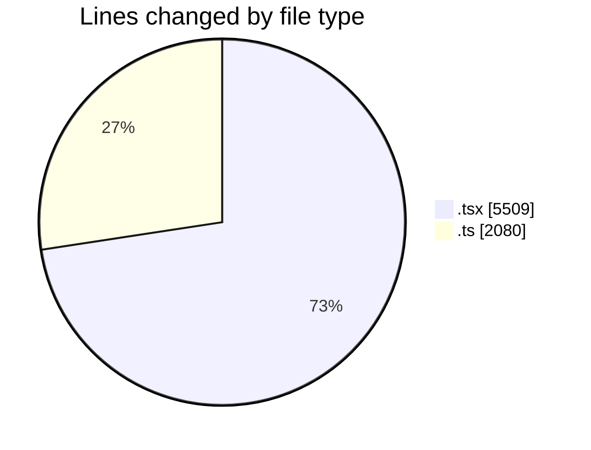
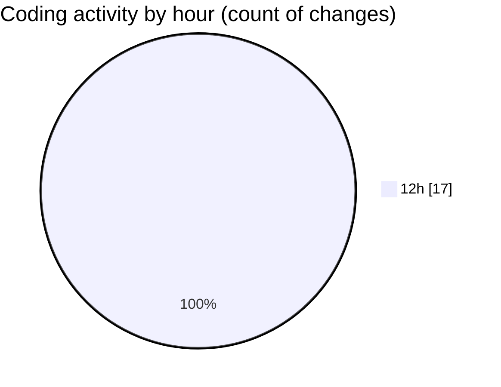

# nxtqube_webapp - Activity Summary 

## Overall Statistics

| Stat                   | Value                                                             |
| ---------------------- | ----------------------------------------------------------------- |
| **Lines Added** (➕)   | 7583                                          |
| **Lines Removed** (➖) | 6                                        |
| **Net Change** (↕)    | 7577                |
| **Active Time** (⌚)   | 13 minutes |

## Modified Files
- **ExistingMission.tsx** (+711, -6)
- **missionUtils.ts** (+315, -0)
- **dataGather.ts** (+82, -0)
- **Existing.tsx** (+215, -0)
- **create3DMission.tsx** (+1566, -0)
- **gridMissionUtils.ts** (+1154, -0)
- **updateMissionStatusService.ts** (+50, -0)
- **missionUtils.ts** (+479, -0)
- **createGridMission.tsx** (+2427, -0)
- **MissionFormDrawer.tsx** (+584, -0)

## Visualizations

### By File Type (Lines Changed)

### By Hour (Estimated Activity Count)

> **Last Updated:** 13/02/2026, 13:01:53