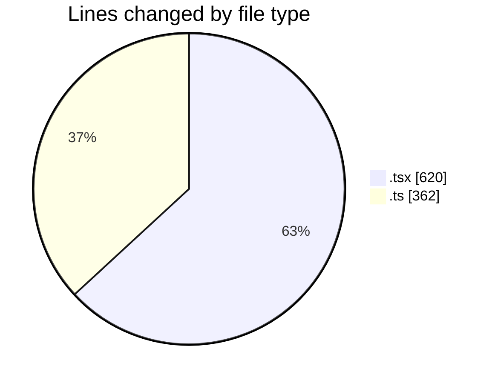
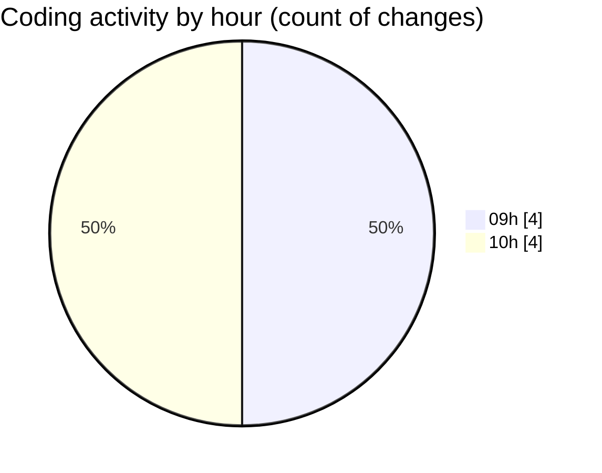

# nxtqube_webapp - Activity Summary 

## Overall Statistics

| Stat                   | Value                                                             |
| ---------------------- | ----------------------------------------------------------------- |
| **Lines Added** (➕)   | 958                                          |
| **Lines Removed** (➖) | 24                                        |
| **Net Change** (↕)    | 934                |
| **Active Time** (⌚)   | 11 minutes |

## Modified Files
- **createPathMission.tsx** (+46, -0)
- **mission.validator.ts** (+361, -0)
- **mission.model.ts** (+0, -1)
- **MissionInfo.tsx** (+495, -0)
- **DeleteMission.tsx** (+56, -0)
- **WaypointActionNew.tsx** (+0, -23)

## Visualizations

### By File Type (Lines Changed)

### By Hour (Estimated Activity Count)

> **Last Updated:** 18/02/2026, 10:21:03