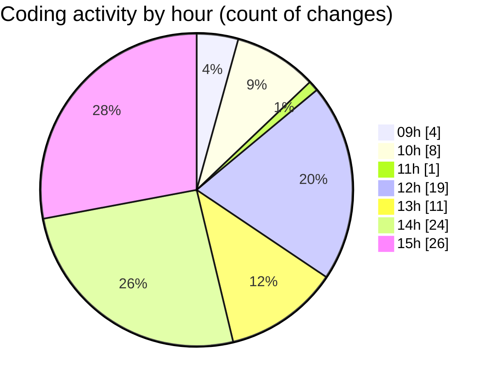

# nxtqube_webapp - Activity Summary 

## Overall Statistics

| Stat                   | Value                                                             |
| ---------------------- | ----------------------------------------------------------------- |
| **Lines Added** (➕)   | 4401                                          |
| **Lines Removed** (➖) | 605                                        |
| **Net Change** (↕)    | 3796                |
| **Active Time** (⌚)   | 126 minutes |

## Modified Files
- **createPathMission.tsx** (+409, -21)
- **mission.validator.ts** (+723, -1)
- **mission.model.ts** (+0, -1)
- **MissionInfo.tsx** (+1365, -378)
- **DeleteMission.tsx** (+56, -0)
- **WaypointActionNew.tsx** (+520, -56)
- **missionUtils.ts** (+480, -0)
- **MissionControlNew.tsx** (+634, -148)
- **waypointContext.tsx** (+214, -0)

## Visualizations

### By File Type (Lines Changed)

### By Hour (Estimated Activity Count)

> **Last Updated:** 18/02/2026, 15:56:10