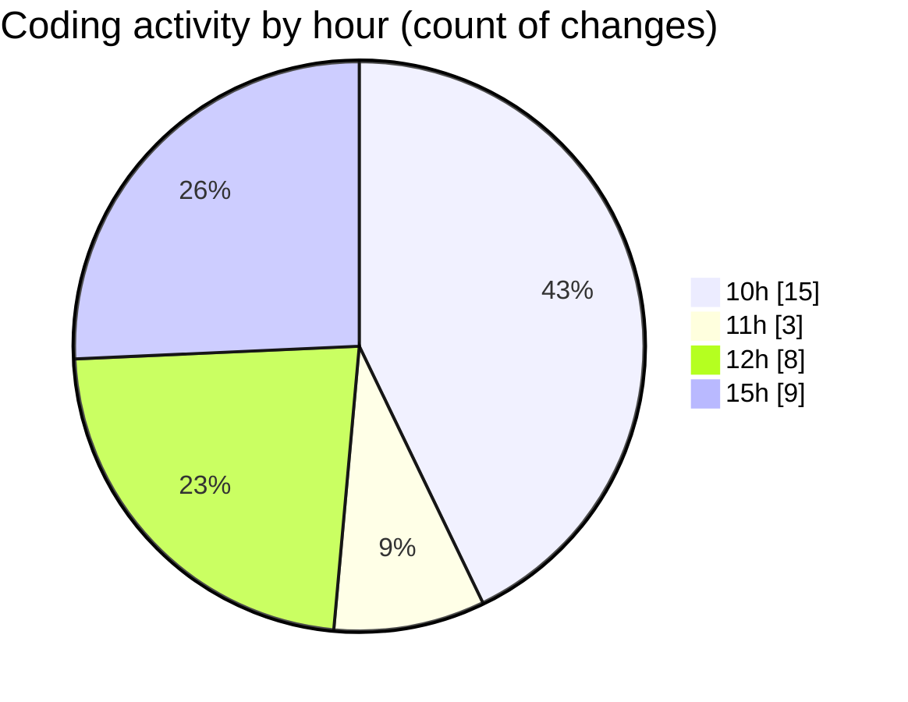

# nxtqube_webapp - Activity Summary 

## Overall Statistics

| Stat                   | Value                                                             |
| ---------------------- | ----------------------------------------------------------------- |
| **Lines Added** (➕)   | 3941                                          |
| **Lines Removed** (➖) | 24                                        |
| **Net Change** (↕)    | 3917                |
| **Active Time** (⌚)   | 53 minutes |

## Modified Files
- **MissionInfo.tsx** (+658, -0)
- **createPathMission.tsx** (+514, -10)
- **missionUtils.ts** (+487, -5)
- **WaypointActionNew.tsx** (+535, -0)
- **MissionControlNew.tsx** (+657, -0)
- **waypointContext.tsx** (+221, -0)
- **mission.validator.ts** (+371, -9)
- **mission.controller.ts** (+189, -0)
- **Existing.tsx** (+309, -0)

## Visualizations

### By File Type (Lines Changed)

### By Hour (Estimated Activity Count)

> **Last Updated:** 19/02/2026, 15:51:44