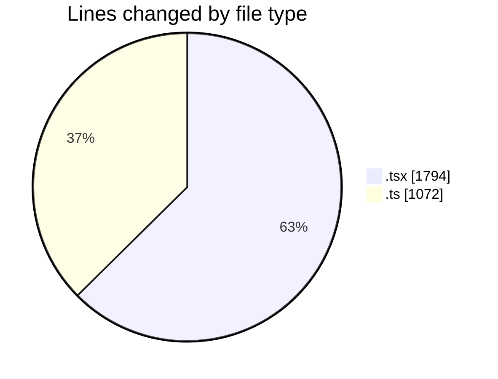
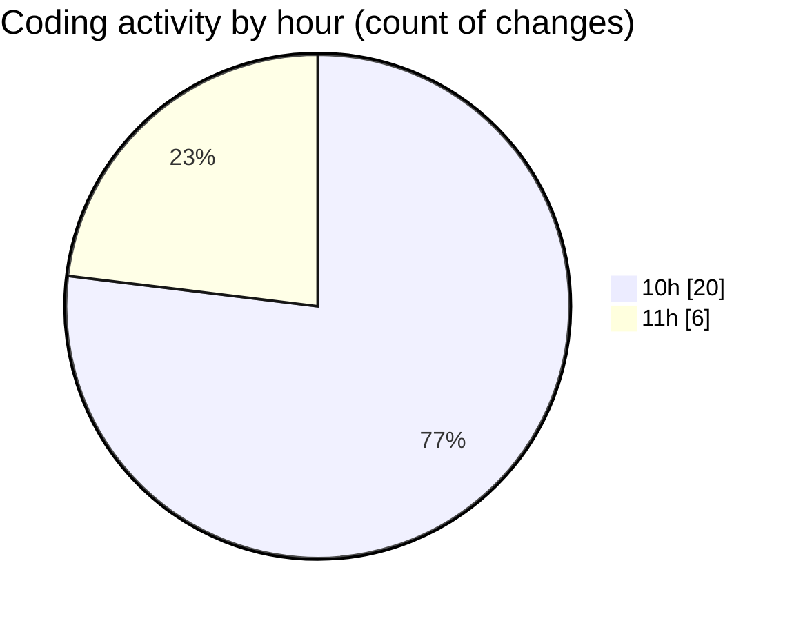

# nxtqube_webapp - Activity Summary 

## Overall Statistics

| Stat                   | Value                                                             |
| ---------------------- | ----------------------------------------------------------------- |
| **Lines Added** (➕)   | 2843                                          |
| **Lines Removed** (➖) | 23                                        |
| **Net Change** (↕)    | 2820                |
| **Active Time** (⌚)   | 31 minutes |

## Modified Files
- **ExistingMission.tsx** (+715, -5)
- **useMissions.ts** (+60, -1)
- **mission.route.ts** (+47, -4)
- **ajax.ts** (+243, -0)
- **mission.action.ts** (+140, -3)
- **Existing.tsx** (+339, -1)
- **mission.controller.ts** (+196, -7)
- **mission.validator.ts** (+371, -0)
- **MissionUpload.tsx** (+73, -2)
- **LaunchControl.tsx** (+659, -0)

## Visualizations

### By File Type (Lines Changed)

### By Hour (Estimated Activity Count)

> **Last Updated:** 20/02/2026, 11:18:58