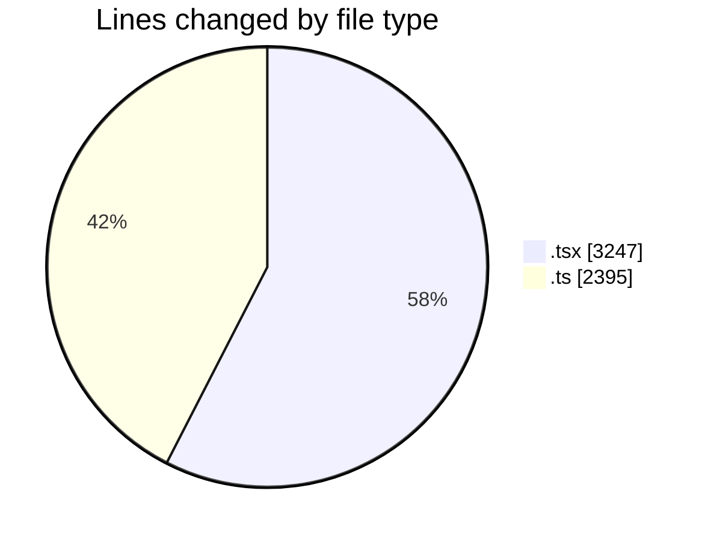
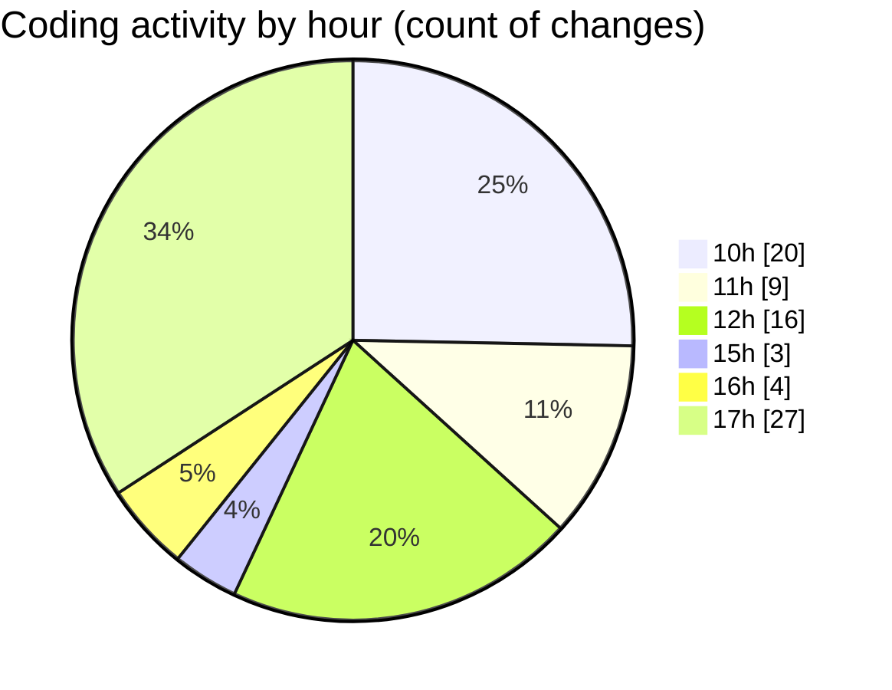

# nxtqube_webapp - Activity Summary 

## Overall Statistics

| Stat                   | Value                                                             |
| ---------------------- | ----------------------------------------------------------------- |
| **Lines Added** (➕)   | 4736                                          |
| **Lines Removed** (➖) | 906                                        |
| **Net Change** (↕)    | 3830                |
| **Active Time** (⌚)   | 93 minutes |

## Modified Files
- **ExistingMission.tsx** (+747, -37)
- **useMissions.ts** (+60, -1)
- **mission.route.ts** (+61, -11)
- **ajax.ts** (+243, -0)
- **mission.action.ts** (+140, -3)
- **Existing.tsx** (+462, -124)
- **mission.controller.ts** (+622, -430)
- **mission.validator.ts** (+371, -0)
- **MissionUpload.tsx** (+73, -2)
- **LaunchControl.tsx** (+870, -188)
- **DroneList.tsx** (+468, -0)
- **cesium.context.tsx** (+190, -86)
- **mission-sequence-builder.ts** (+429, -24)

## Visualizations

### By File Type (Lines Changed)

### By Hour (Estimated Activity Count)

> **Last Updated:** 20/02/2026, 17:50:53