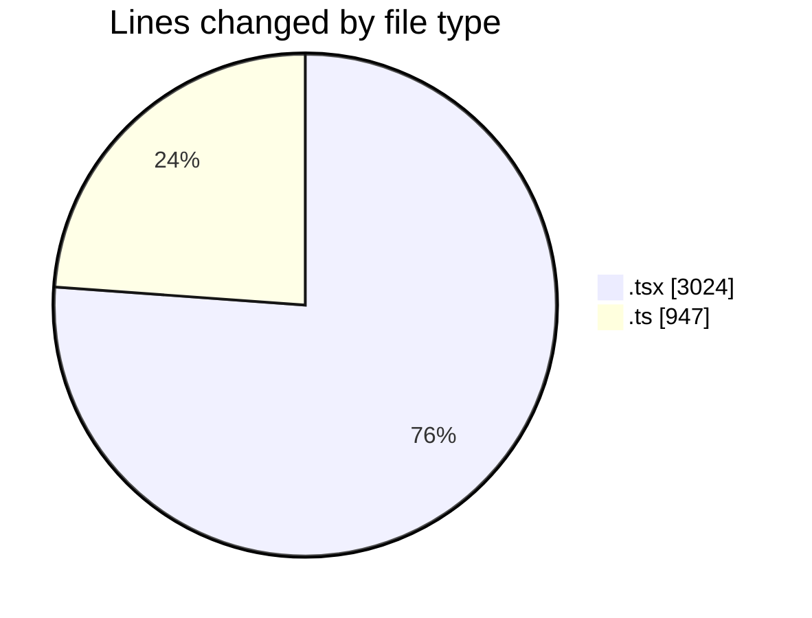
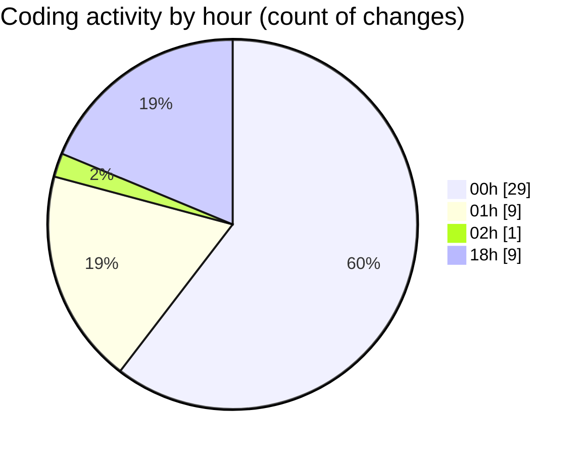

# nxtqube_webapp - Activity Summary 

## Overall Statistics

| Stat                   | Value                                                             |
| ---------------------- | ----------------------------------------------------------------- |
| **Lines Added** (➕)   | 1813                                          |
| **Lines Removed** (➖) | 2158                                        |
| **Net Change** (↕)    | -345                |
| **Active Time** (⌚)   | 69 minutes |

## Modified Files
- **createGridMission.tsx** (+864, -2158)
- **useGridMission.ts** (+576, -0)
- **createGridMissionPage.tsx** (+2, -0)
- **mission.validator.ts** (+371, -0)

## Visualizations

### By File Type (Lines Changed)

### By Hour (Estimated Activity Count)

> **Last Updated:** 22/02/2026, 18:49:08