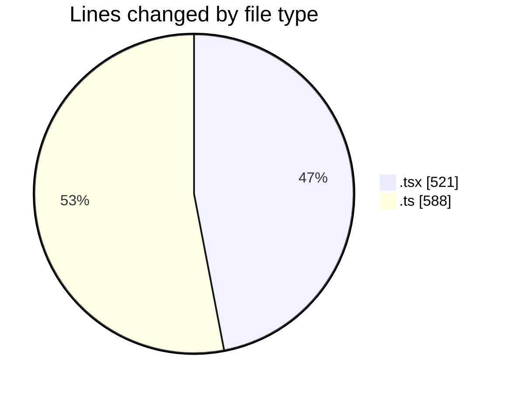
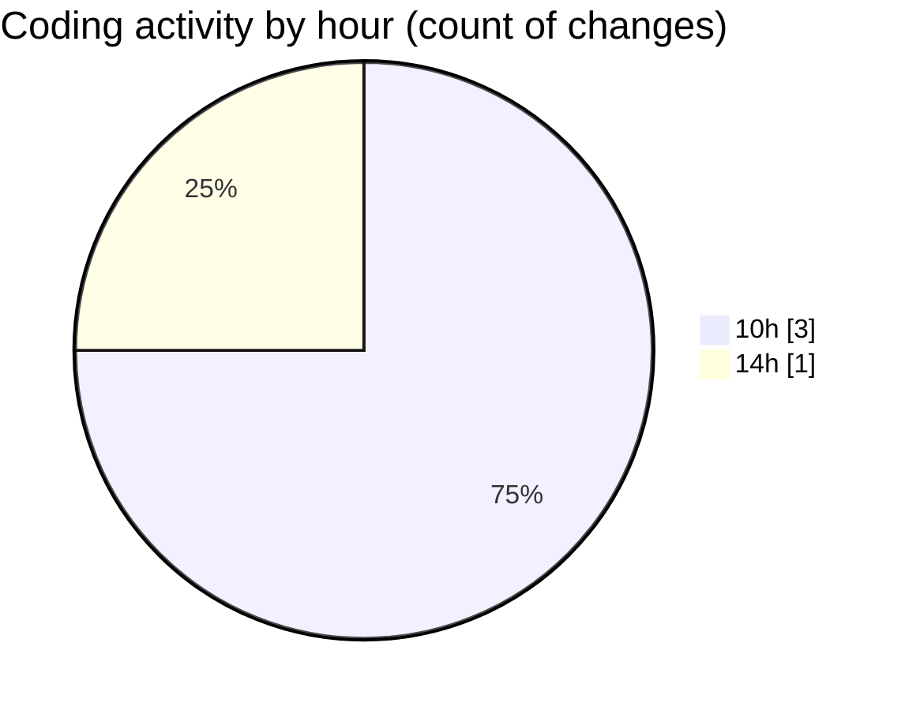

# nxtqube_webapp - Activity Summary 

## Overall Statistics

| Stat                   | Value                                                             |
| ---------------------- | ----------------------------------------------------------------- |
| **Lines Added** (➕)   | 1109                                          |
| **Lines Removed** (➖) | 0                                        |
| **Net Change** (↕)    | 1109                |
| **Active Time** (⌚)   | 0 minute |

## Modified Files
- **use.cesium.map.tsx** (+462, -0)
- **Existing.tsx** (+16, -0)
- **useGridMission.ts** (+588, -0)
- **createGridMission.tsx** (+43, -0)

## Visualizations

### By File Type (Lines Changed)

### By Hour (Estimated Activity Count)

> **Last Updated:** 24/02/2026, 14:34:03