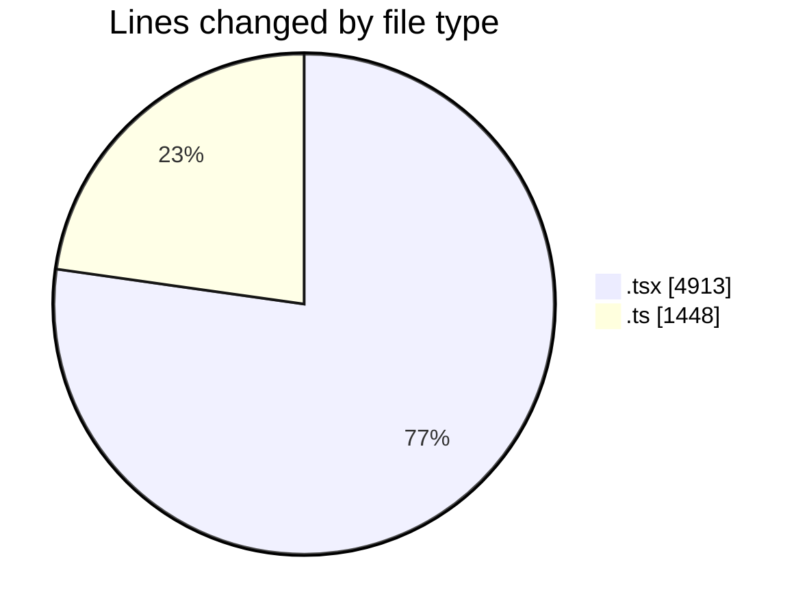
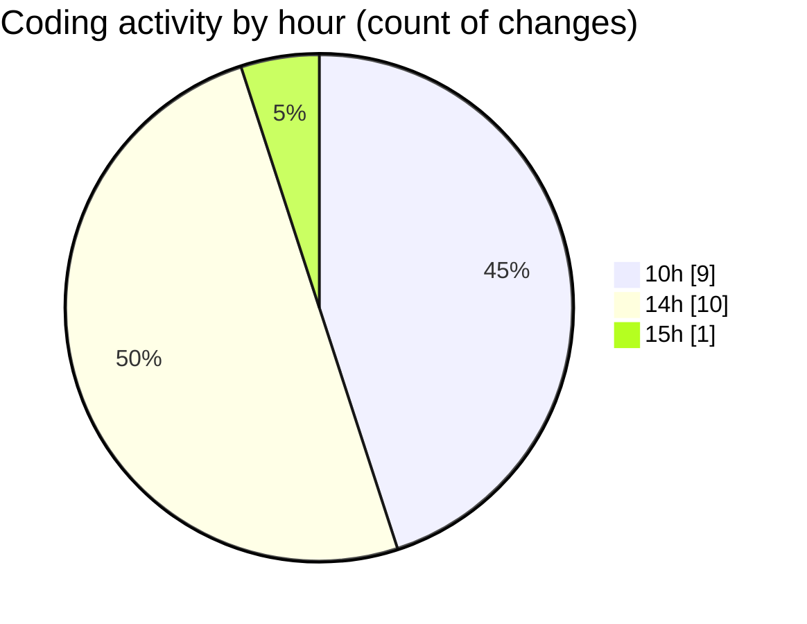

# nxtqube_webapp - Activity Summary 

## Overall Statistics

| Stat                   | Value                                                             |
| ---------------------- | ----------------------------------------------------------------- |
| **Lines Added** (➕)   | 6245                                          |
| **Lines Removed** (➖) | 116                                        |
| **Net Change** (↕)    | 6129                |
| **Active Time** (⌚)   | 17 minutes |

## Modified Files
- **cesium.context.tsx** (+158, -3)
- **LaunchControl.tsx** (+686, -46)
- **mission.scheduler.service.ts** (+410, -67)
- **mission.validator.ts** (+368, -0)
- **router.tsx** (+213, -0)
- **routes.ts** (+121, -0)
- **createMissionHome.tsx** (+671, -0)
- **MissionControlNew.tsx** (+662, -0)
- **MissionInfo.tsx** (+657, -0)
- **ExistingMission.tsx** (+559, -0)
- **WaypointActionNew.tsx** (+535, -0)
- **missionUtils.ts** (+482, -0)
- **createGridMission.tsx** (+723, -0)

## Visualizations

### By File Type (Lines Changed)

### By Hour (Estimated Activity Count)

> **Last Updated:** 26/02/2026, 15:08:59