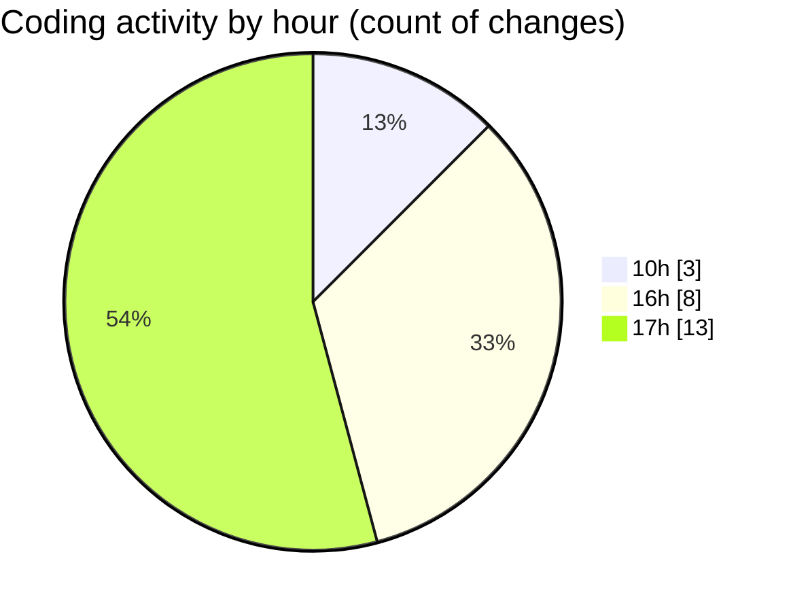

# nxtqube_webapp - Activity Summary 

## Overall Statistics

| Stat                   | Value                                                             |
| ---------------------- | ----------------------------------------------------------------- |
| **Lines Added** (➕)   | 2076                                          |
| **Lines Removed** (➖) | 39                                        |
| **Net Change** (↕)    | 2037                |
| **Active Time** (⌚)   | 45 minutes |

## Modified Files
- **ConfirmModal.tsx** (+45, -1)
- **useGridMission.ts** (+798, -38)
- **cesium.provider.tsx** (+471, -0)
- **cesium.context.tsx** (+156, -0)
- **createPathMission.tsx** (+606, -0)

## Visualizations

### By File Type (Lines Changed)

### By Hour (Estimated Activity Count)

> **Last Updated:** 27/02/2026, 18:03:56