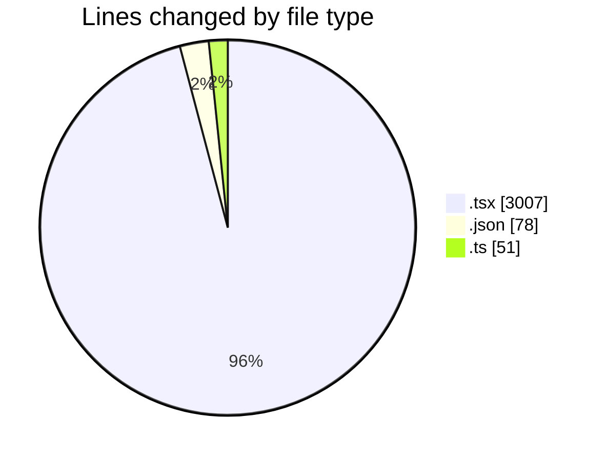
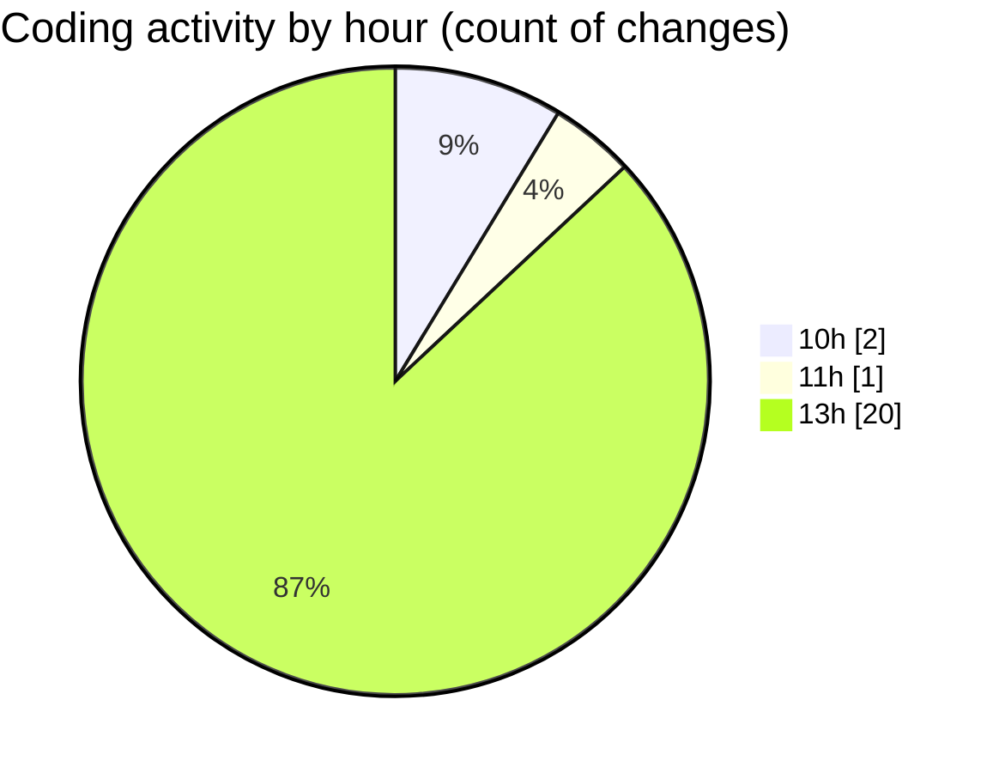

# nxtqube_webapp - Activity Summary 

## Overall Statistics

| Stat                   | Value                                                             |
| ---------------------- | ----------------------------------------------------------------- |
| **Lines Added** (➕)   | 3125                                          |
| **Lines Removed** (➖) | 11                                        |
| **Net Change** (↕)    | 3114                |
| **Active Time** (⌚)   | 21 minutes |

## Modified Files
- **createPathMission.tsx** (+729, -2)
- **create3DMission.tsx** (+320, -0)
- **package.json** (+77, -1)
- **LaunchControl.tsx** (+633, -1)
- **ManageMission.tsx** (+379, -4)
- **validateGridSiteArea.ts** (+50, -1)
- **PayloadControls.tsx** (+328, -1)
- **WaypointActionNew.tsx** (+609, -1)

## Visualizations

### By File Type (Lines Changed)

### By Hour (Estimated Activity Count)

> **Last Updated:** 03/03/2026, 14:00:40