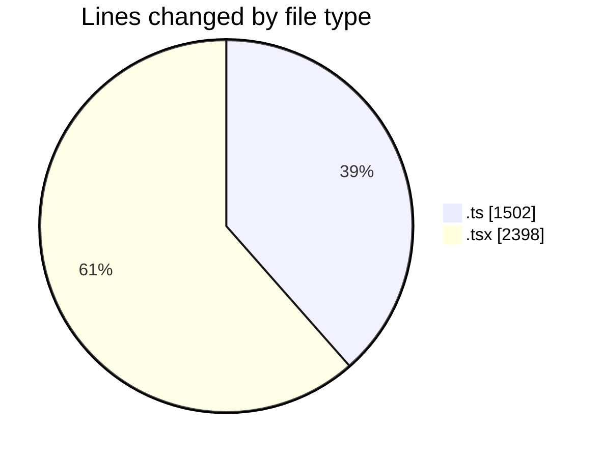
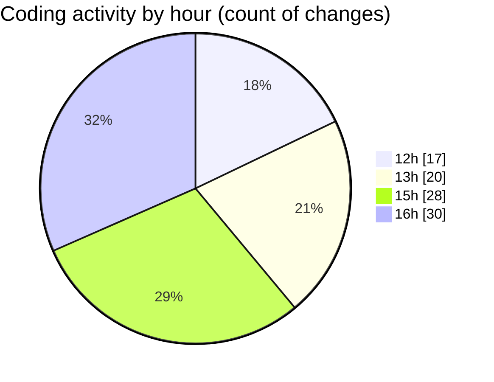

# nxtqube_webapp - Activity Summary 

## Overall Statistics

| Stat                   | Value                                                             |
| ---------------------- | ----------------------------------------------------------------- |
| **Lines Added** (➕)   | 3736                                          |
| **Lines Removed** (➖) | 164                                        |
| **Net Change** (↕)    | 3572                |
| **Active Time** (⌚)   | 117 minutes |

## Modified Files
- **useGridMission.ts** (+787, -40)
- **ConfirmModal.tsx** (+54, -2)
- **MissionSlider.tsx** (+133, -1)
- **missionUtils.ts** (+572, -103)
- **createGridMission.tsx** (+1125, -2)
- **createMissionHome.tsx** (+672, -8)
- **create3DMission.tsx** (+393, -8)

## Visualizations

### By File Type (Lines Changed)

### By Hour (Estimated Activity Count)

> **Last Updated:** 04/03/2026, 16:58:03