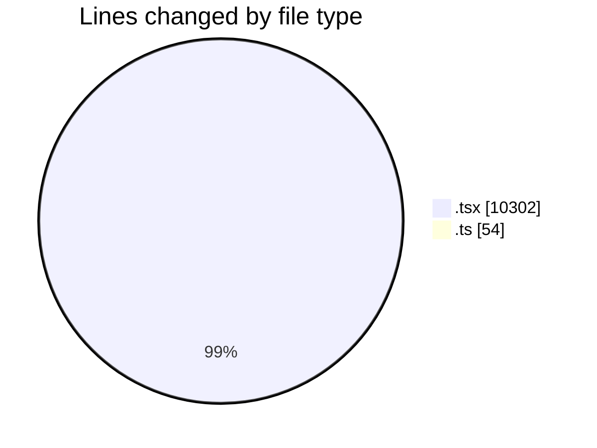
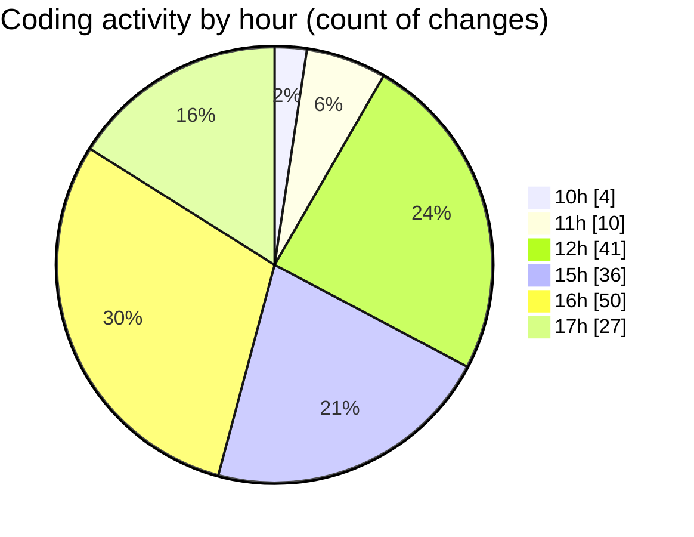

# nxtqube_webapp - Activity Summary 

## Overall Statistics

| Stat                   | Value                                                             |
| ---------------------- | ----------------------------------------------------------------- |
| **Lines Added** (➕)   | 9143                                          |
| **Lines Removed** (➖) | 1213                                        |
| **Net Change** (↕)    | 7930                |
| **Active Time** (⌚)   | 227 minutes |

## Modified Files
- **createGridMission.tsx** (+1180, -10)
- **createMissionHome.tsx** (+719, -381)
- **createPathMission.tsx** (+1364, -568)
- **DeleteMission.tsx** (+74, -7)
- **gridUI.tsx** (+956, -124)
- **Mission3DControl.tsx** (+161, -0)
- **create3DMission.tsx** (+385, -0)
- **MissionControlNew.tsx** (+692, -2)
- **MissionControl.tsx** (+690, -1)
- **MissionInfo.tsx** (+682, -54)
- **label.actions.ts** (+24, -0)
- **label.reducer.ts** (+30, -0)
- **MissionPlannerUI.tsx** (+579, -5)
- **WaypointActionNew.tsx** (+724, -0)
- **WaypointAction.tsx** (+883, -61)

## Visualizations

### By File Type (Lines Changed)

### By Hour (Estimated Activity Count)

> **Last Updated:** 05/03/2026, 18:01:36