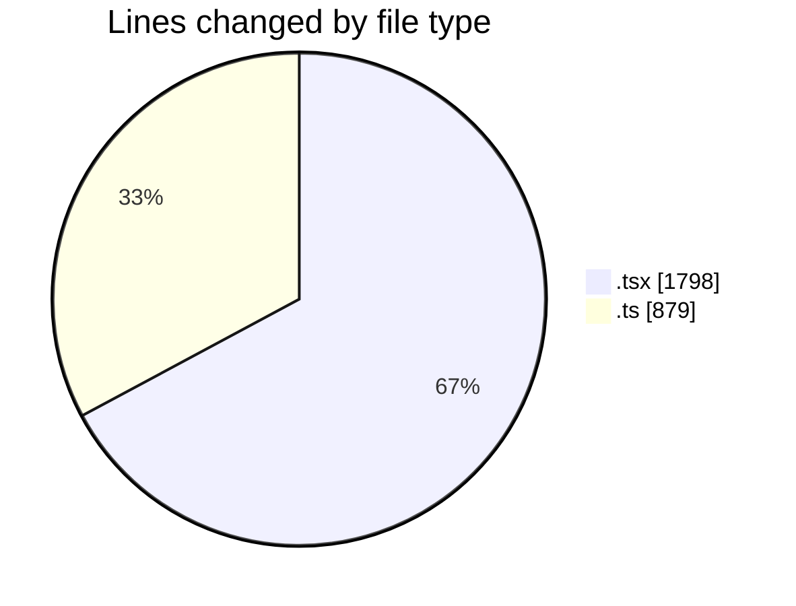
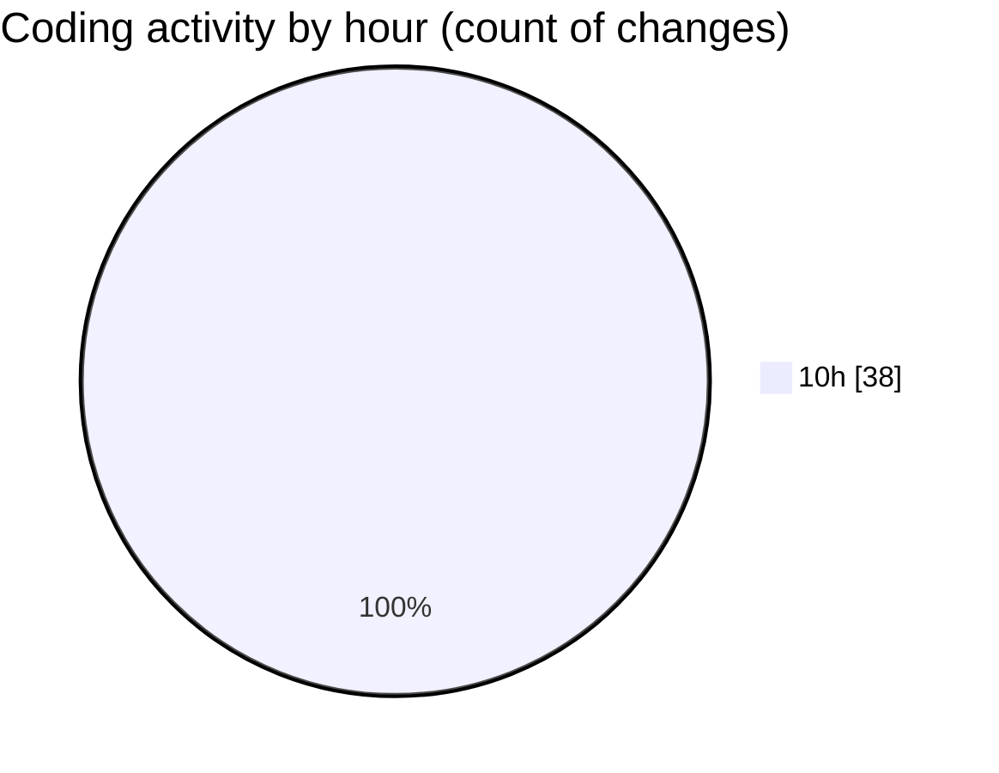

# nxtqube_webapp - Activity Summary 

## Overall Statistics

| Stat                   | Value                                                             |
| ---------------------- | ----------------------------------------------------------------- |
| **Lines Added** (➕)   | 2390                                          |
| **Lines Removed** (➖) | 287                                        |
| **Net Change** (↕)    | 2103                |
| **Active Time** (⌚)   | 50 minutes |

## Modified Files
- **create3DMission.tsx** (+385, -4)
- **WaypointAction.tsx** (+833, -0)
- **apiUtils.ts** (+21, -1)
- **ExistingMission.tsx** (+559, -17)
- **hookUtils.ts** (+273, -212)
- **index.ts** (+4, -0)
- **missionUtils.ts** (+315, -53)

## Visualizations

### By File Type (Lines Changed)

### By Hour (Estimated Activity Count)

> **Last Updated:** 06/03/2026, 10:38:10