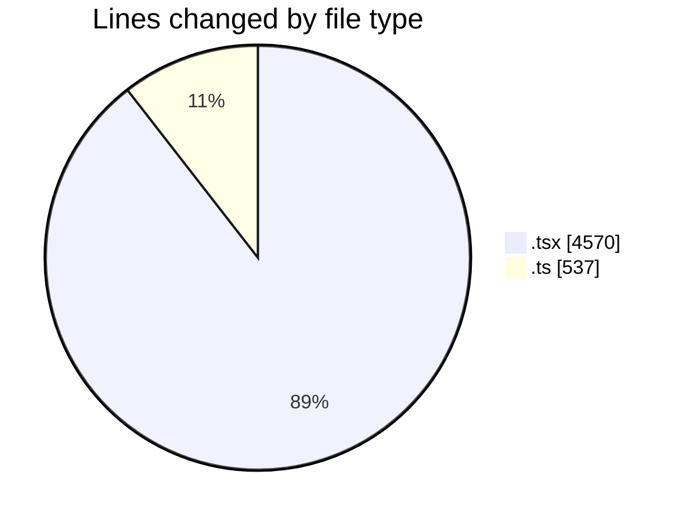
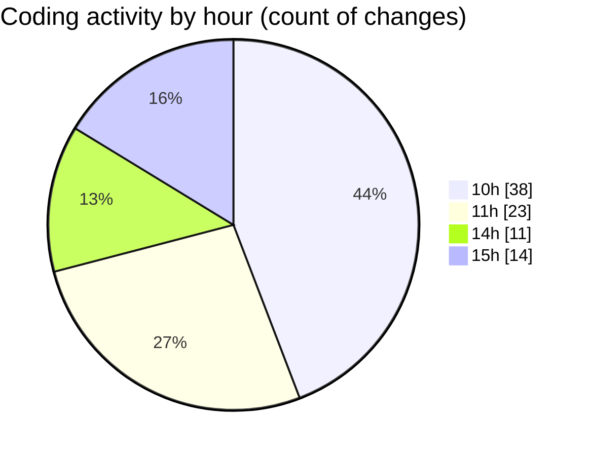

# nxtqube_webapp - Activity Summary 

## Overall Statistics

| Stat                   | Value                                                             |
| ---------------------- | ----------------------------------------------------------------- |
| **Lines Added** (➕)   | 4828                                          |
| **Lines Removed** (➖) | 279                                        |
| **Net Change** (↕)    | 4549                |
| **Active Time** (⌚)   | 98 minutes |

## Modified Files
- **LaunchControl.tsx** (+564, -141)
- **createGridMission.tsx** (+1170, -6)
- **missionUtils.ts** (+469, -68)
- **createMissionHome.tsx** (+338, -13)
- **DeleteMission.tsx** (+67, -3)
- **WaypointAction.tsx** (+955, -33)
- **ExistingMission.tsx** (+559, -0)
- **ManageMission.tsx** (+243, -3)
- **MissionPages.tsx** (+297, -12)
- **MissionsNav.tsx** (+166, -0)

## Visualizations

### By File Type (Lines Changed)

### By Hour (Estimated Activity Count)

> **Last Updated:** 10/03/2026, 15:38:31