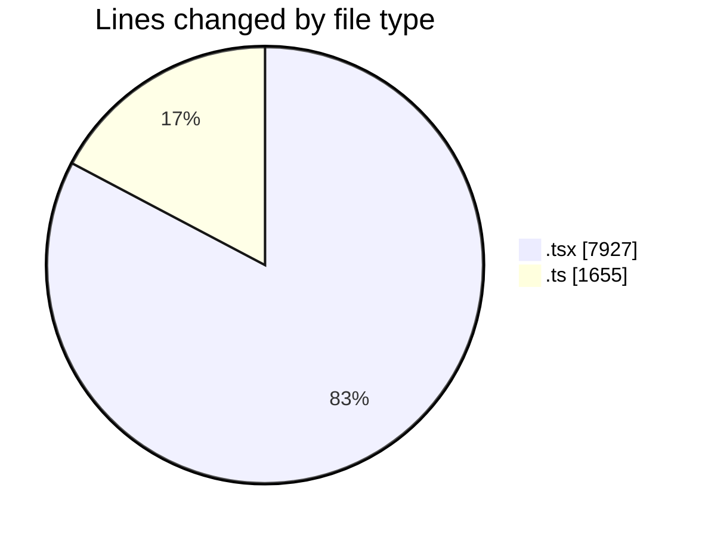
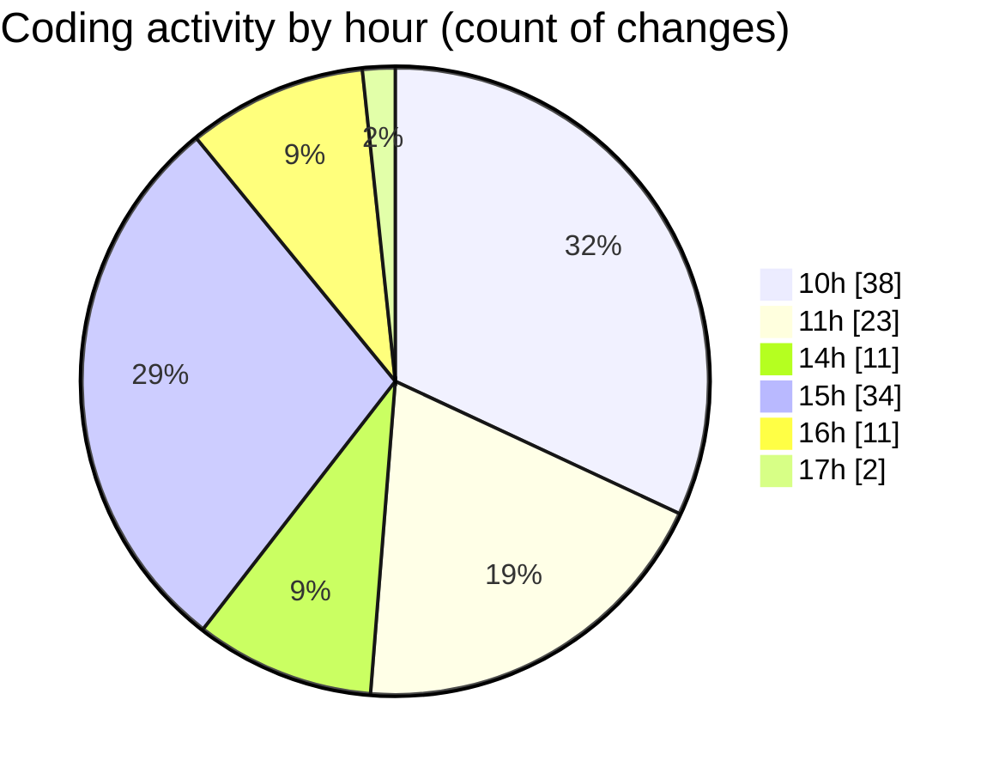

# nxtqube_webapp - Activity Summary 

## Overall Statistics

| Stat                   | Value                                                             |
| ---------------------- | ----------------------------------------------------------------- |
| **Lines Added** (➕)   | 9218                                          |
| **Lines Removed** (➖) | 364                                        |
| **Net Change** (↕)    | 8854                |
| **Active Time** (⌚)   | 138 minutes |

## Modified Files
- **LaunchControl.tsx** (+564, -141)
- **createGridMission.tsx** (+1170, -6)
- **missionUtils.ts** (+469, -68)
- **createMissionHome.tsx** (+338, -13)
- **DeleteMission.tsx** (+67, -3)
- **WaypointAction.tsx** (+955, -33)
- **ExistingMission.tsx** (+559, -0)
- **ManageMission.tsx** (+243, -3)
- **MissionPages.tsx** (+300, -36)
- **MissionsNav.tsx** (+169, -1)
- **MissionsLayout.tsx** (+83, -0)
- **CreateMissionSelector.tsx** (+181, -1)
- **geogence.create.tsx** (+1873, -8)
- **Existing.tsx** (+524, -0)
- **MapView.tsx** (+171, -0)
- **cesium.provider.tsx** (+485, -0)
- **interaction.ts** (+41, -0)
- **click.ts** (+13, -0)
- **drag.ts** (+25, -0)
- **missionDataSlice.ts** (+92, -0)
- **missionFormSlice.ts** (+90, -0)
- **missionStateSlice.ts** (+52, -0)
- **useGridMission.ts** (+754, -51)

## Visualizations

### By File Type (Lines Changed)

### By Hour (Estimated Activity Count)

> **Last Updated:** 10/03/2026, 17:53:31