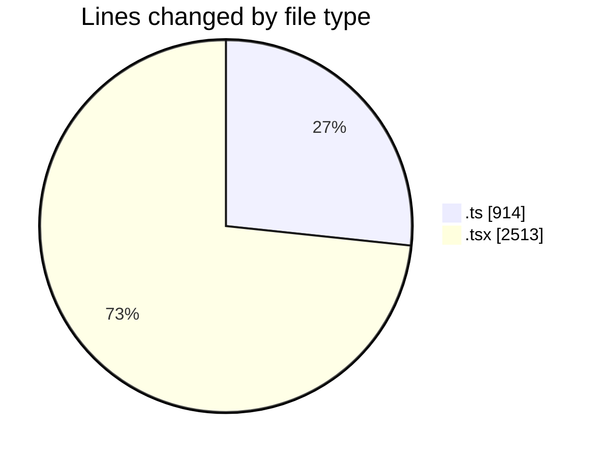
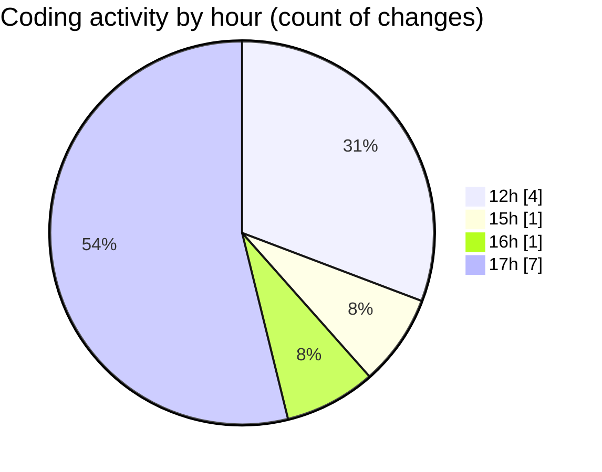

# nxtqube_webapp - Activity Summary 

## Overall Statistics

| Stat                   | Value                                                             |
| ---------------------- | ----------------------------------------------------------------- |
| **Lines Added** (➕)   | 3408                                          |
| **Lines Removed** (➖) | 19                                        |
| **Net Change** (↕)    | 3389                |
| **Active Time** (⌚)   | 13 minutes |

## Modified Files
- **missionUtils.ts** (+427, -0)
- **router.tsx** (+218, -0)
- **createGridMission.tsx** (+1180, -19)
- **ExistingMission.tsx** (+572, -0)
- **ajax.ts** (+276, -0)
- **Existing.tsx** (+524, -0)
- **useMissions.ts** (+61, -0)
- **mission.action.ts** (+150, -0)

## Visualizations

### By File Type (Lines Changed)

### By Hour (Estimated Activity Count)

> **Last Updated:** 11/03/2026, 17:53:50