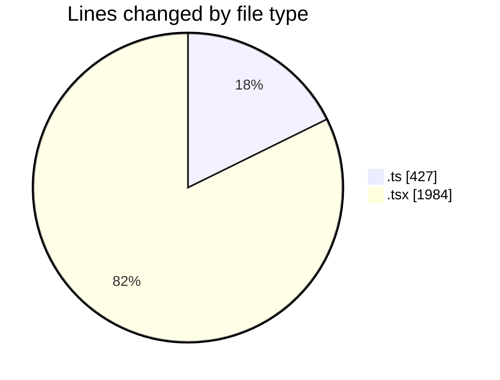
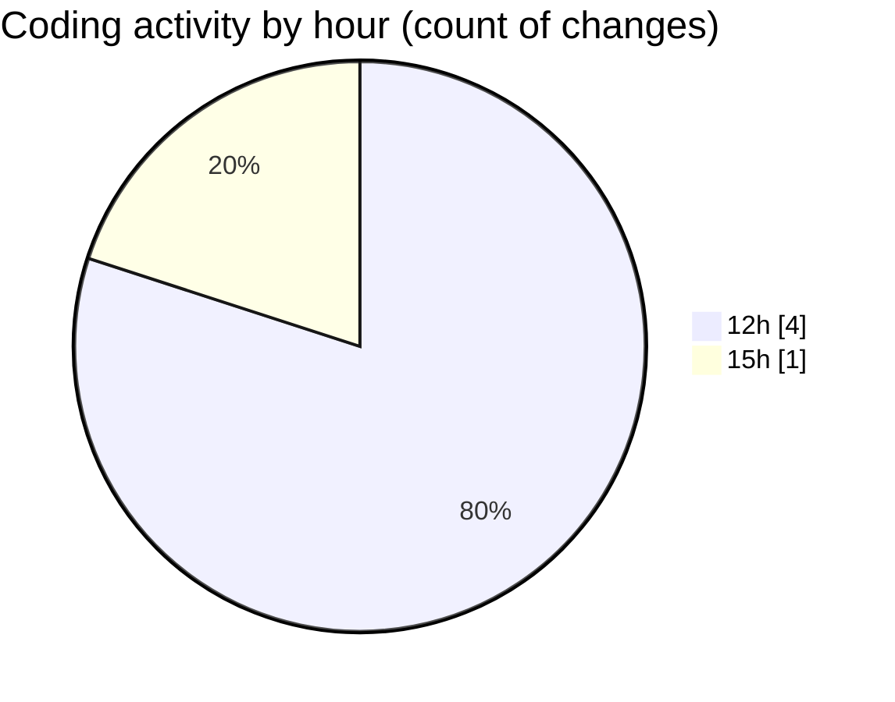

# nxtqube_webapp - Activity Summary 

## Overall Statistics

| Stat                   | Value                                                             |
| ---------------------- | ----------------------------------------------------------------- |
| **Lines Added** (➕)   | 2392                                          |
| **Lines Removed** (➖) | 19                                        |
| **Net Change** (↕)    | 2373                |
| **Active Time** (⌚)   | 4 minutes |

## Modified Files
- **missionUtils.ts** (+427, -0)
- **router.tsx** (+218, -0)
- **createGridMission.tsx** (+1180, -19)
- **ExistingMission.tsx** (+567, -0)

## Visualizations

### By File Type (Lines Changed)

### By Hour (Estimated Activity Count)

> **Last Updated:** 11/03/2026, 15:56:33