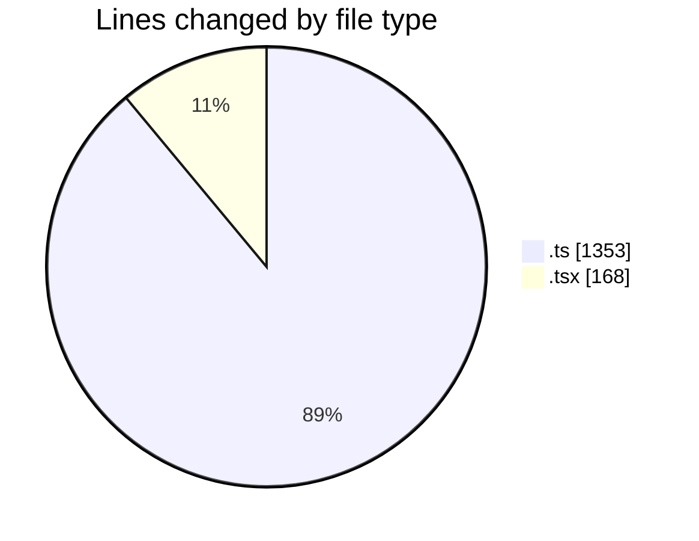
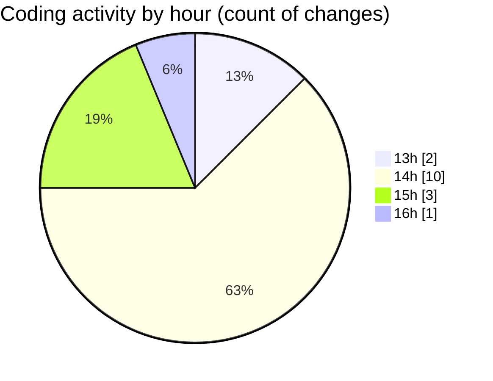

# nxtqube_webapp - Activity Summary 

## Overall Statistics

| Stat                   | Value                                                             |
| ---------------------- | ----------------------------------------------------------------- |
| **Lines Added** (➕)   | 1315                                          |
| **Lines Removed** (➖) | 206                                        |
| **Net Change** (↕)    | 1109                |
| **Active Time** (⌚)   | 17 minutes |

## Modified Files
- **mission.route.ts** (+47, -10)
- **mission.validator.ts** (+680, -193)
- **useMissions.ts** (+61, -0)
- **mission.controller.ts** (+190, -3)
- **mission.action.ts** (+169, -0)
- **MissionsNav.tsx** (+168, -0)

## Visualizations

### By File Type (Lines Changed)

### By Hour (Estimated Activity Count)

> **Last Updated:** 12/03/2026, 16:06:09