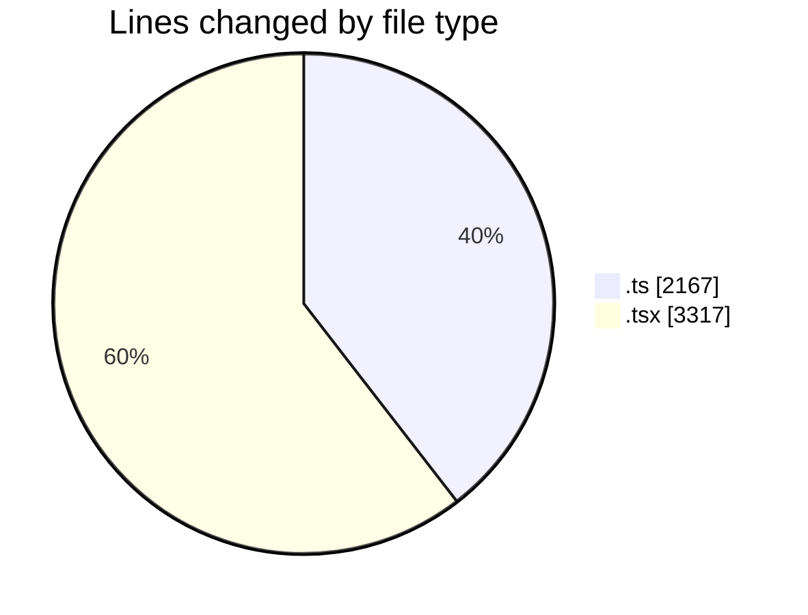
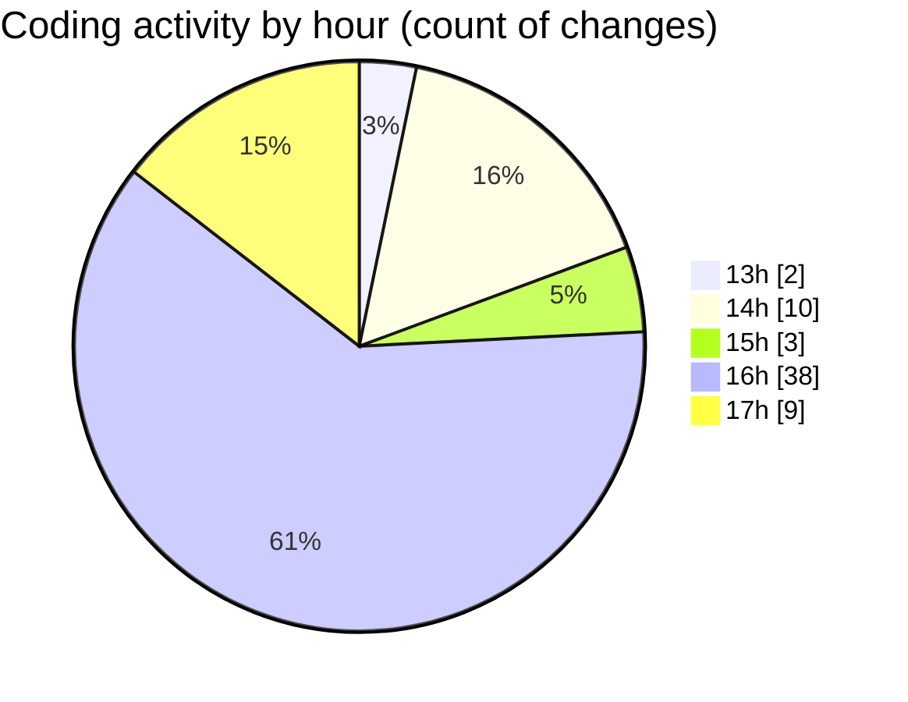

# nxtqube_webapp - Activity Summary 

## Overall Statistics

| Stat                   | Value                                                             |
| ---------------------- | ----------------------------------------------------------------- |
| **Lines Added** (➕)   | 5208                                          |
| **Lines Removed** (➖) | 276                                        |
| **Net Change** (↕)    | 4932                |
| **Active Time** (⌚)   | 80 minutes |

## Modified Files
- **mission.route.ts** (+47, -10)
- **mission.validator.ts** (+680, -193)
- **useMissions.ts** (+61, -0)
- **mission.controller.ts** (+190, -3)
- **mission.action.ts** (+169, -0)
- **MissionsNav.tsx** (+197, -22)
- **MissionSelector.tsx** (+50, -0)
- **Existing.tsx** (+579, -24)
- **ExistingMission.tsx** (+572, -12)
- **LaunchControl.tsx** (+423, -0)
- **SortMission.tsx** (+267, -1)
- **createGridMission.tsx** (+1169, -1)
- **useGridMission.ts** (+804, -10)

## Visualizations

### By File Type (Lines Changed)

### By Hour (Estimated Activity Count)

> **Last Updated:** 12/03/2026, 17:07:01