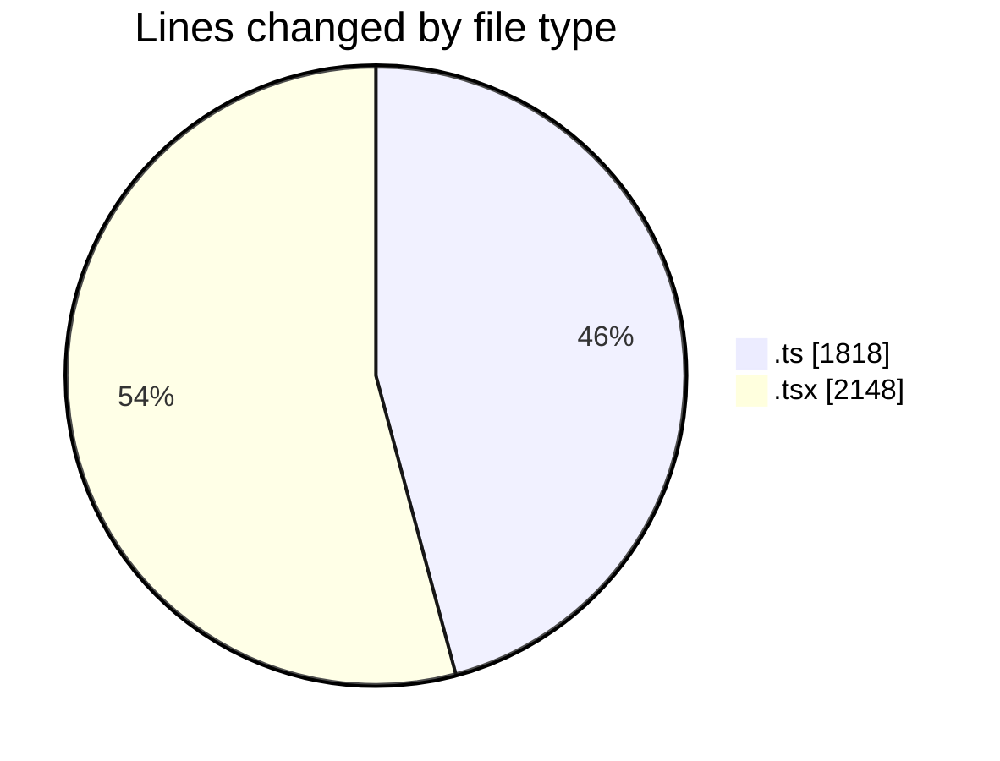
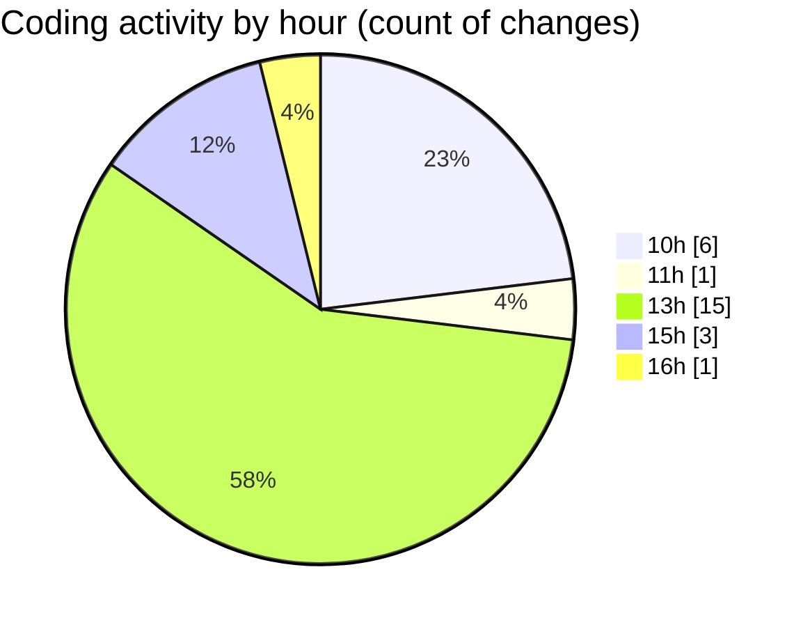

# nxtqube_webapp - Activity Summary 

## Overall Statistics

| Stat                   | Value                                                             |
| ---------------------- | ----------------------------------------------------------------- |
| **Lines Added** (➕)   | 3598                                          |
| **Lines Removed** (➖) | 368                                        |
| **Net Change** (↕)    | 3230                |
| **Active Time** (⌚)   | 31 minutes |

## Modified Files
- **useGridMission.ts** (+1721, -97)
- **geogence.create.tsx** (+1877, -271)

## Visualizations

### By File Type (Lines Changed)

### By Hour (Estimated Activity Count)

> **Last Updated:** 13/03/2026, 16:40:50