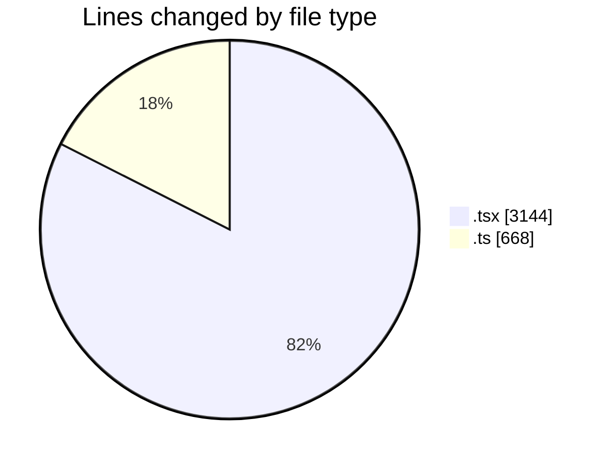
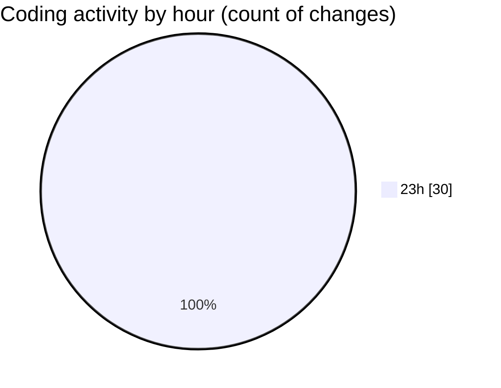

# nxtqube_webapp - Activity Summary 

## Overall Statistics

| Stat                   | Value                                                             |
| ---------------------- | ----------------------------------------------------------------- |
| **Lines Added** (➕)   | 3794                                          |
| **Lines Removed** (➖) | 18                                        |
| **Net Change** (↕)    | 3776                |
| **Active Time** (⌚)   | 38 minutes |

## Modified Files
- **geogence.create.tsx** (+1729, -5)
- **createPathMission.tsx** (+857, -1)
- **geofence.card.tsx** (+285, -3)
- **geogence.list.tsx** (+264, -0)
- **use.geofence.map.ts** (+168, -8)
- **use.polygon.geofence.ts** (+491, -1)

## Visualizations

### By File Type (Lines Changed)

### By Hour (Estimated Activity Count)

> **Last Updated:** 14/03/2026, 23:58:36