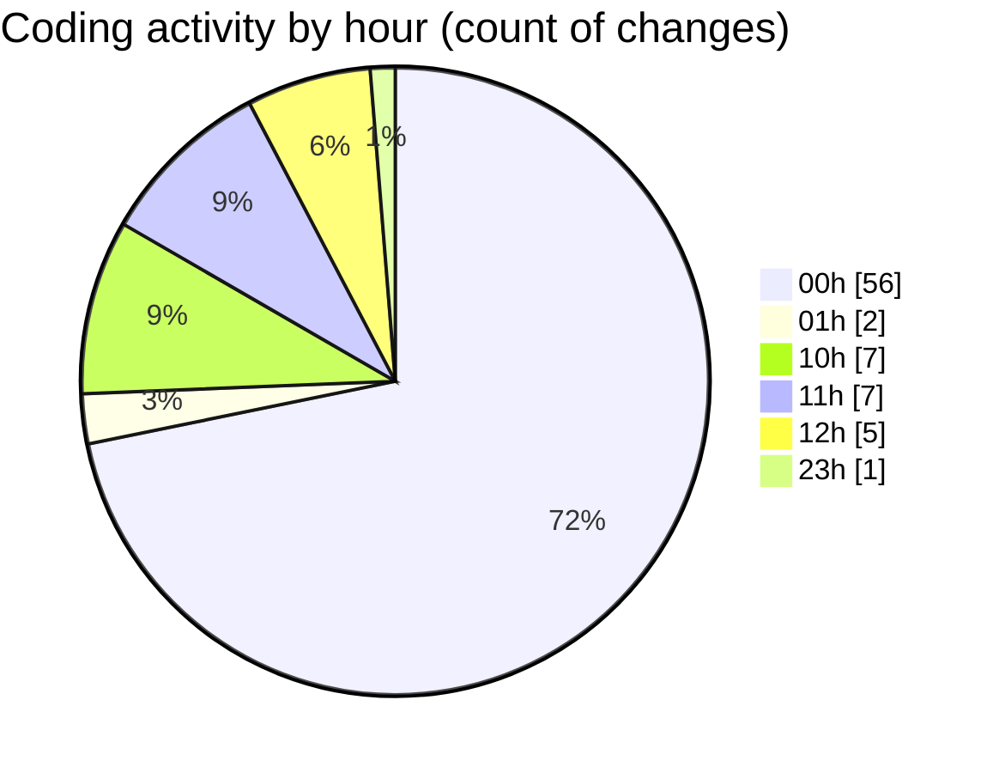

# nxtqube_webapp - Activity Summary 

## Overall Statistics

| Stat                   | Value                                                             |
| ---------------------- | ----------------------------------------------------------------- |
| **Lines Added** (➕)   | 2428                                          |
| **Lines Removed** (➖) | 1246                                        |
| **Net Change** (↕)    | 1182                |
| **Active Time** (⌚)   | 102 minutes |

## Modified Files
- **geogence.create.tsx** (+116, -141)
- **use.geofence.map.ts** (+17, -0)
- **createPathMission.tsx** (+38, -38)
- **createGridMission.tsx** (+2257, -1067)

## Visualizations

### By File Type (Lines Changed)

### By Hour (Estimated Activity Count)

> **Last Updated:** 15/03/2026, 12:42:33