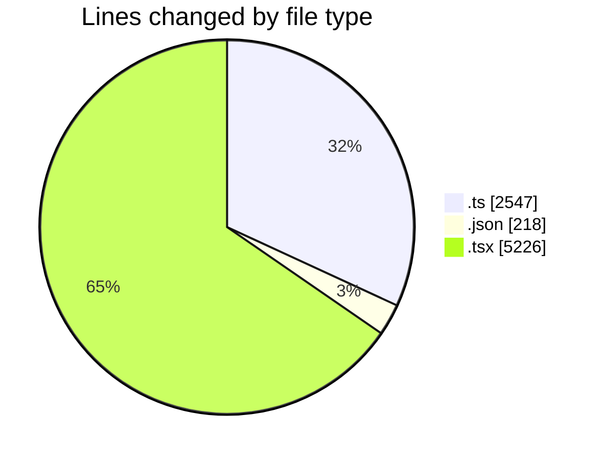

# nxtqube_webapp - Activity Summary 

## Overall Statistics

| Stat                   | Value                                                             |
| ---------------------- | ----------------------------------------------------------------- |
| **Lines Added** (➕)   | 5658                                          |
| **Lines Removed** (➖) | 2333                                        |
| **Net Change** (↕)    | 3325                |
| **Active Time** (⌚)   | 57 minutes |

## Modified Files
- **missionUtils.ts** (+550, -453)
- **package.json** (+78, -0)
- **package.json** (+64, -0)
- **package.json** (+76, -0)
- **createGridMission.tsx** (+1740, -1347)
- **store.ts** (+166, -12)
- **missionUtils.ts** (+427, -0)
- **Existing.tsx** (+733, -290)
- **ExistingMission.tsx** (+625, -66)
- **mission.validator.ts** (+651, -146)
- **StreamContext.tsx** (+409, -16)
- **geofence.validator.ts** (+139, -3)

## Visualizations

### By File Type (Lines Changed)

### By Hour (Estimated Activity Count)

> **Last Updated:** 16/03/2026, 11:52:16