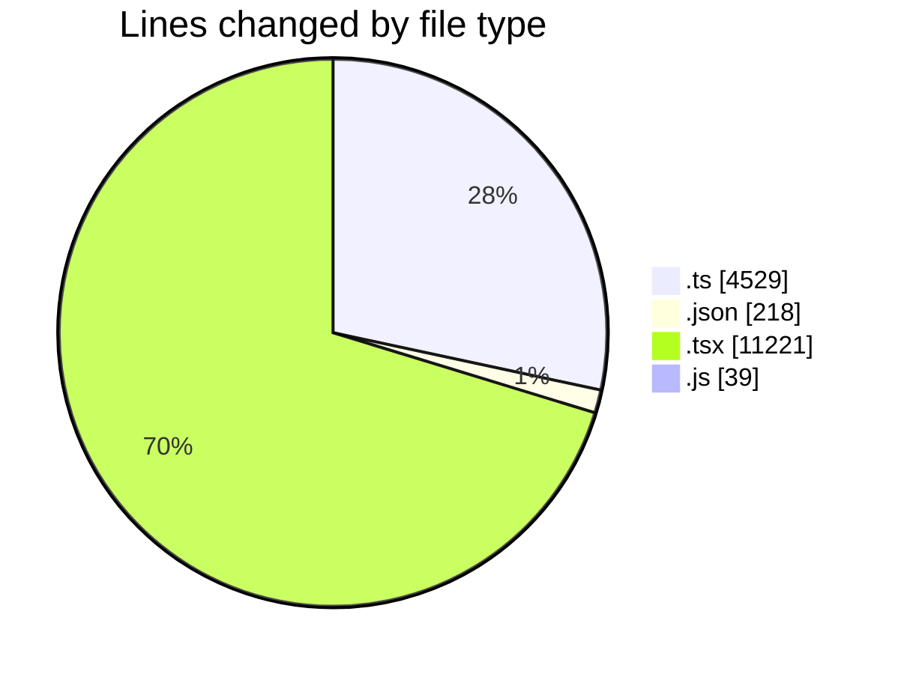
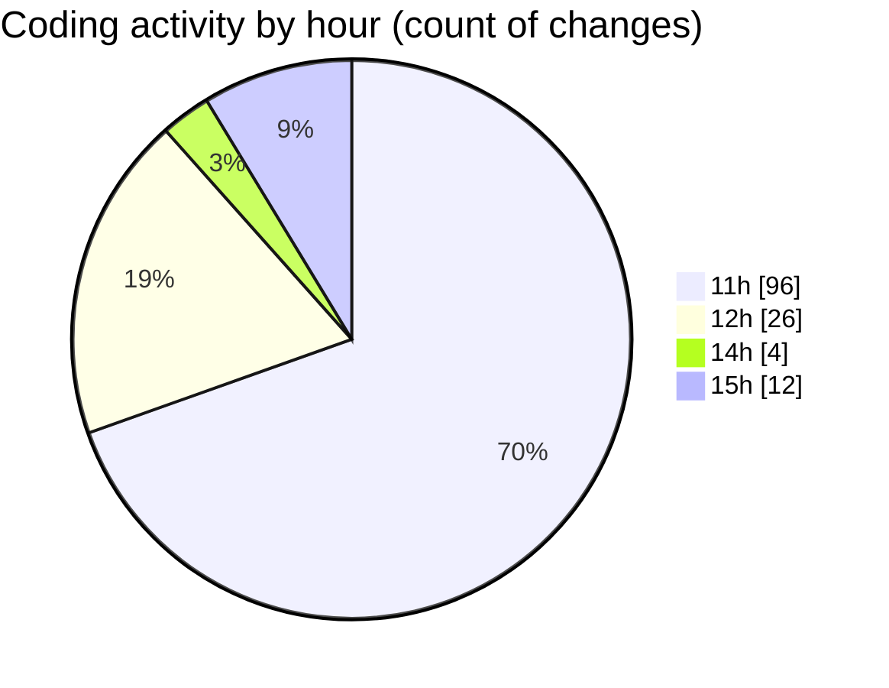

# nxtqube_webapp - Activity Summary 

## Overall Statistics

| Stat                   | Value                                                             |
| ---------------------- | ----------------------------------------------------------------- |
| **Lines Added** (➕)   | 13614                                          |
| **Lines Removed** (➖) | 2393                                        |
| **Net Change** (↕)    | 11221                |
| **Active Time** (⌚)   | 142 minutes |

## Modified Files
- **missionUtils.ts** (+550, -453)
- **package.json** (+78, -0)
- **package.json** (+64, -0)
- **package.json** (+76, -0)
- **createGridMission.tsx** (+1741, -1347)
- **store.ts** (+166, -12)
- **missionUtils.ts** (+428, -1)
- **Existing.tsx** (+733, -290)
- **ExistingMission.tsx** (+625, -66)
- **mission.validator.ts** (+651, -146)
- **StreamContext.tsx** (+409, -16)
- **geofence.validator.ts** (+139, -3)
- **MissionActions.tsx** (+35, -1)
- **MissionControls.tsx** (+467, -1)
- **MissionHeader.tsx** (+77, -1)
- **MissionStats.tsx** (+91, -0)
- **useGridMission.ts** (+801, -1)
- **ConfirmModal.tsx** (+53, -1)
- **MissionSlider.tsx** (+133, -1)
- **eventHandlers.ts** (+122, -1)
- **gridMissionUtils.ts** (+183, -1)
- **index.ts** (+8, -1)
- **missionDataHandler.ts** (+169, -0)
- **styles.ts** (+40, -1)
- **DeleteMission.tsx** (+65, -1)
- **Mission3DControl.tsx** (+161, -0)
- **MissionControl.tsx** (+689, -0)
- **MissionInfo.tsx** (+628, -0)
- **WaypointAction.tsx** (+922, -0)
- **create3DMission.tsx** (+381, -0)
- **createMissionHome.tsx** (+325, -0)
- **createPathMission.tsx** (+869, -1)
- **label.actions.ts** (+81, -1)
- **label.reducer.ts** (+30, -1)
- **MissionPages.tsx** (+265, -1)
- **MissionSelector.tsx** (+299, -34)
- **MissionsLayout.tsx** (+84, -1)
- **MissionsNav.tsx** (+176, -1)
- **router.tsx** (+230, -0)
- **vite.config.js** (+39, -0)
- **vitest.config.ts** (+23, -0)
- **command.controller.ts** (+304, -4)
- **mission.controller.ts** (+204, -4)

## Visualizations

### By File Type (Lines Changed)

### By Hour (Estimated Activity Count)

> **Last Updated:** 16/03/2026, 15:37:00