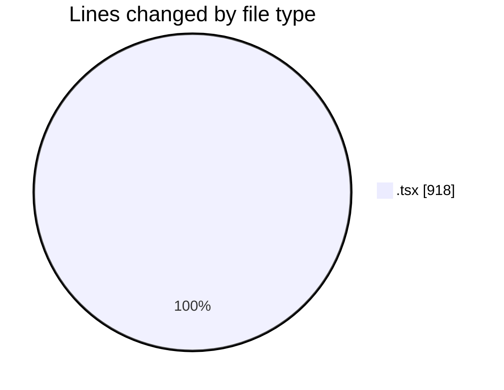
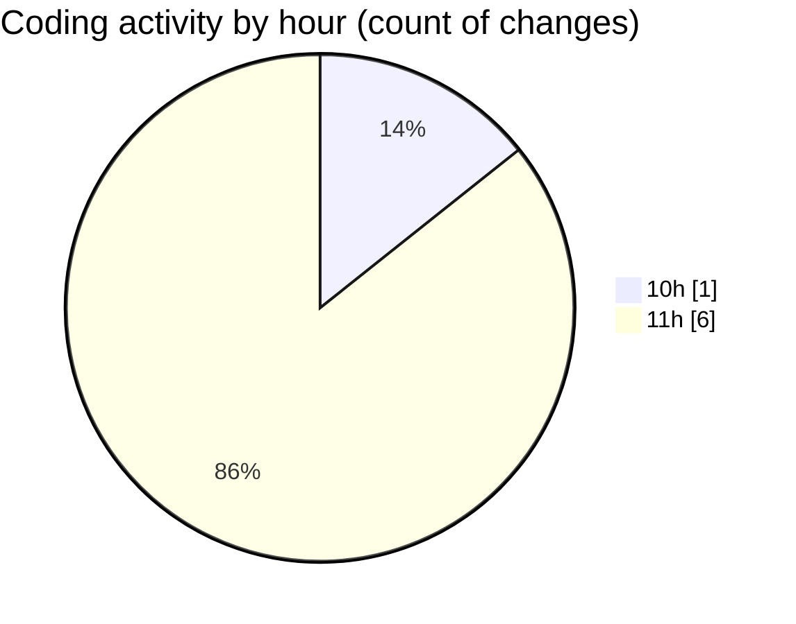

# nxtqube_webapp - Activity Summary 

## Overall Statistics

| Stat                   | Value                                                             |
| ---------------------- | ----------------------------------------------------------------- |
| **Lines Added** (➕)   | 912                                          |
| **Lines Removed** (➖) | 6                                        |
| **Net Change** (↕)    | 906                |
| **Active Time** (⌚)   | 10 minutes |

## Modified Files
- **create3DMission.tsx** (+457, -0)
- **MissionTypeSelector.tsx** (+63, -4)
- **StackMissionControl.tsx** (+392, -2)

## Visualizations

### By File Type (Lines Changed)

### By Hour (Estimated Activity Count)

> **Last Updated:** 18/03/2026, 11:06:07